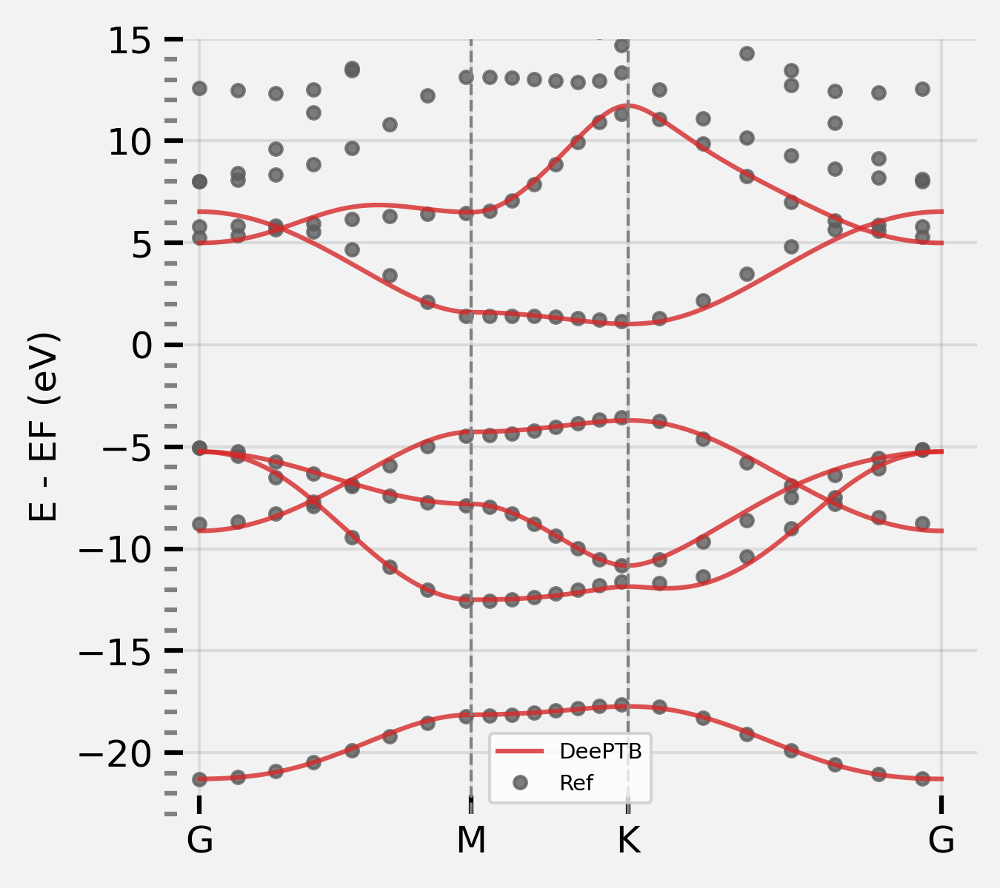
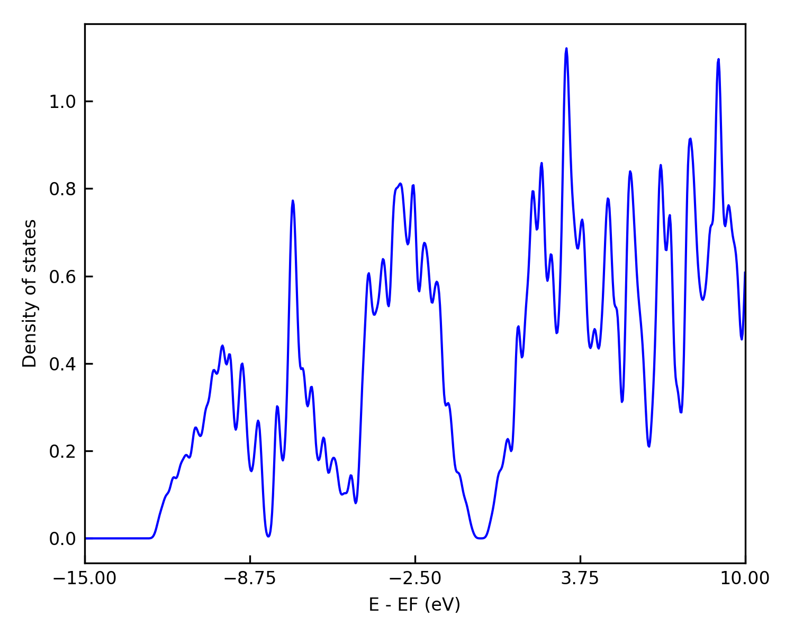
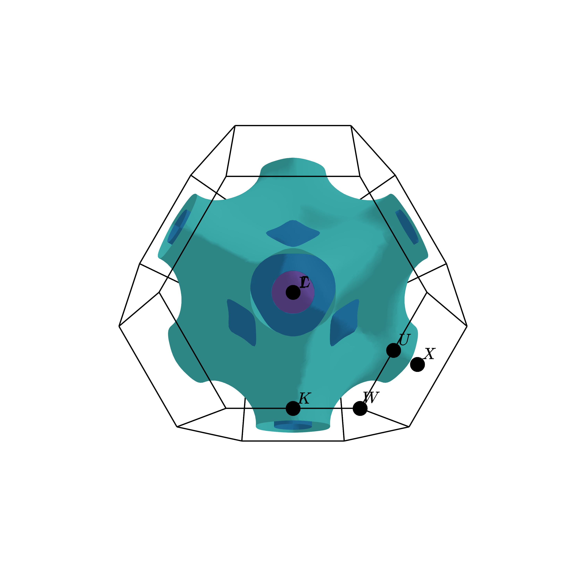
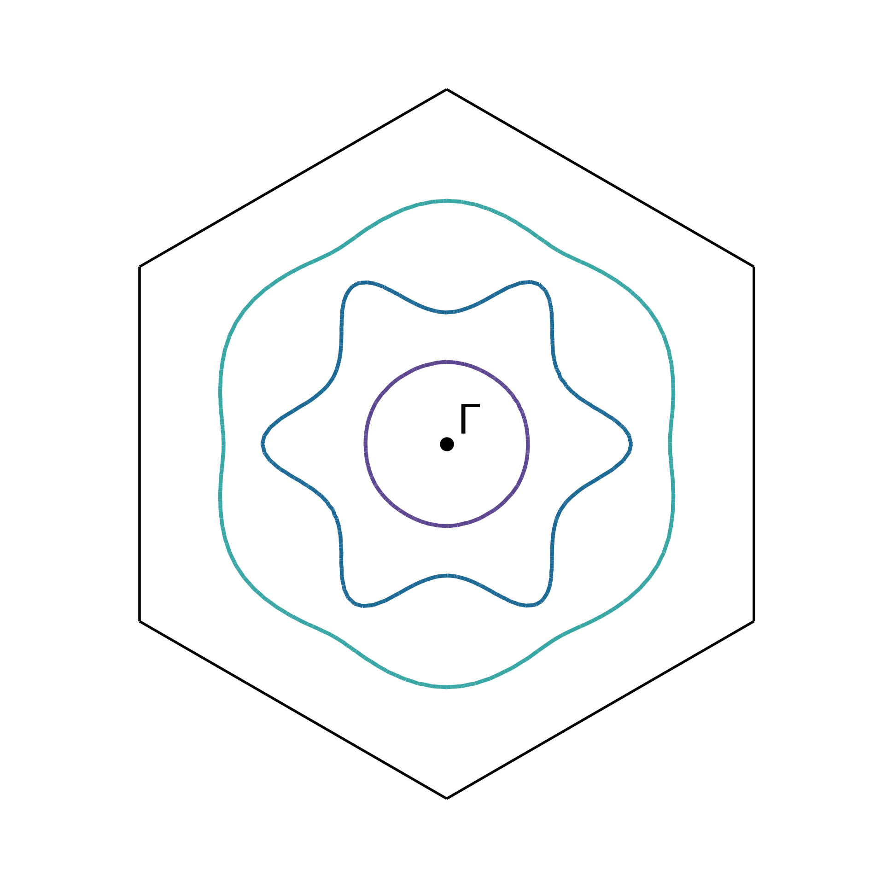
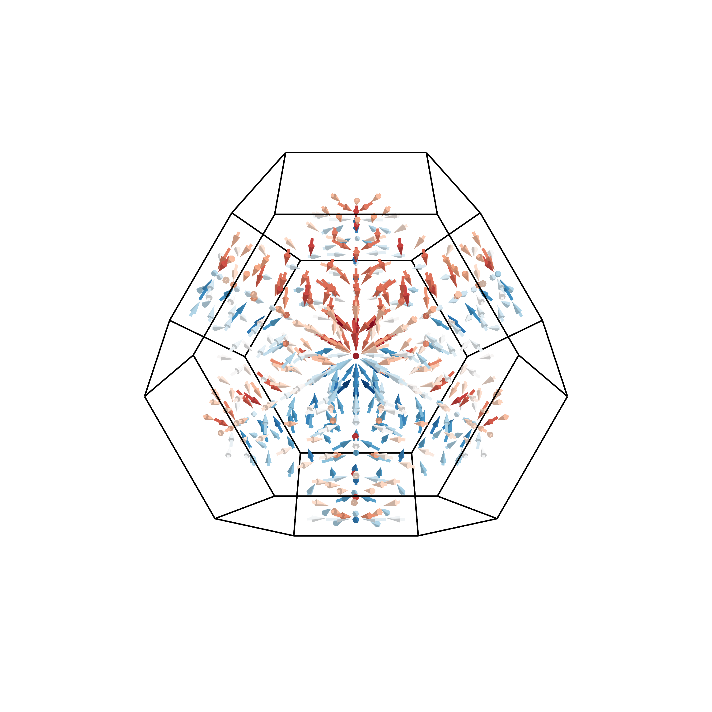
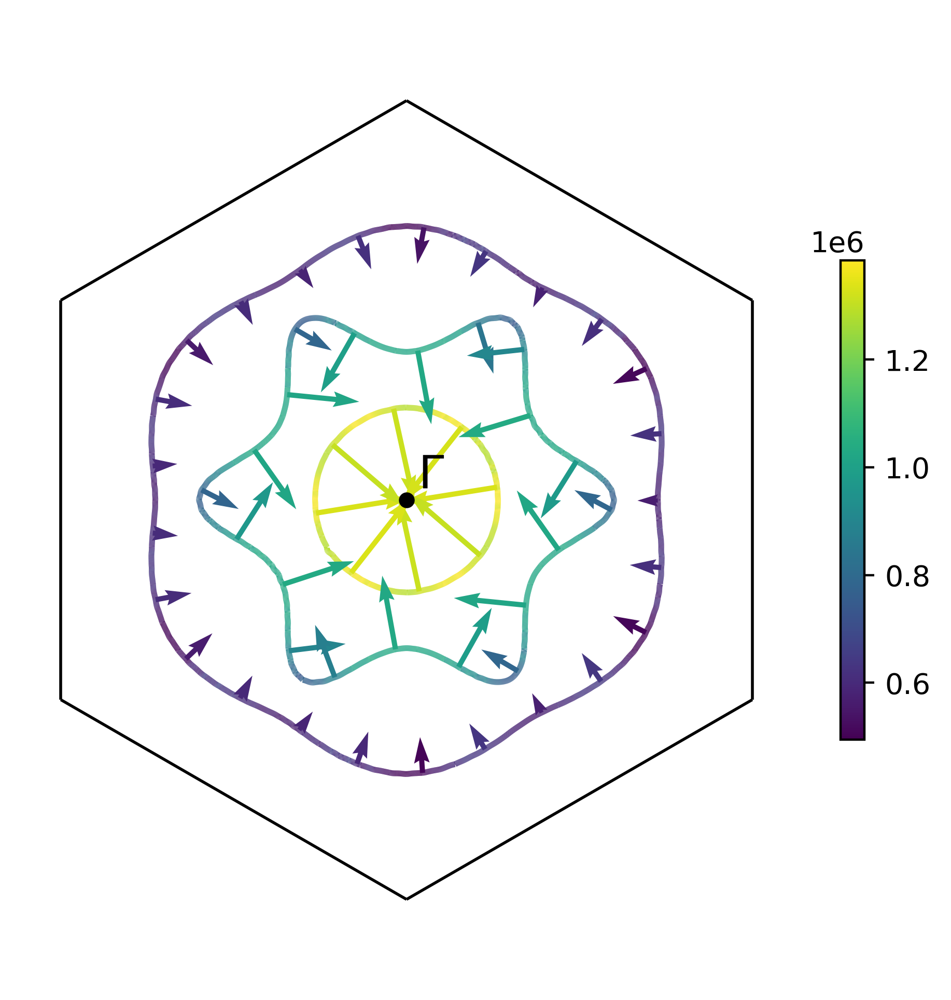

**DeePTB** is a Python package that adopts the deep learning method to construct electronic tight-binding (TB) Hamiltonians using a minimal basis.
With a neural network environmental correction scheme, **DeePTB** can efficiently predict TB Hamiltonians for large-size unseen structures with *ab initio* accuracy after training with *ab initio* eigenvalues from smaller sizes. 
This feature enables efficient simulations of large-size systems under structural perturbations such as strain, which is crucial for semiconductor band gap engineering. Furthermore, DeePTB offers the ability to perform efficient and accurate finite temperature simulations, incorporating both atomic and electronic behaviour through the integration of molecular dynamics (MD). Another significant advantage is that using eigenvalues as the training labels makes DeePTB much more flexible and independent of the choice of various bases (PW or LCAO) and the exchange-correlation (XC) functionals (LDA, GGA and even HSE) used in preparing the training labels. In addition, **DeePTB** can handle systems with strong spin-orbit coupling (SOC) effects.
These capabilities make **DeePTB** adaptable to various research scenarios, extending its applicability to a wide range of materials and phenomena and offering a powerful and versatile tool for accurate and efficient simulations.

See more details in our DeePTB paper: [arXiv:2307.04638](http://arxiv.org/abs/2307.04638)

In summary, **DeePTB** offers the following key features:
- Slater-Koster-like parameterization with customizable radial dependence.
- Orthogonal basis tight-binding Hamiltonian with a customizable number of basis and bond neighbours.
- Incorporation of local atomic and bond environmental corrections using symmetry-preserving neural networks.
- Utilization of an efficient gradient-based fitting algorithm based on autograd implementation.
- Flexibility and independence from the choice of bases and XC functionals used in preparing the training labels.
- Ability to handle systems with strong spin-orbit coupling effects.
- Efficient and accurate finite temperature simulations through integration with molecular dynamics.

 
 <!--The full document can be found on [readthedoc page](https://deeptb-doc.readthedocs.io/en/latest/index.html).--> 
 
- [1. **installation**](#1-installation)
  - [**From Source**](#from-source)
  - [**From Pypi**](#from-pypi)
  - [**From Conda**](#from-conda)
- [2. **Getting Started.**](#2-getting-started)
  - [2.1 **Data**](#21-data)
    - [**Bandinfo**](#bandinfo)
  - [2.2 **input json**](#22-input-json)
  - [2.3 **Training**](#23-training)
  - [2.4 **Testing**](#24-testing)
  - [2.5 **Processing**](#25-processing)
- [3. **Example: hBN.**](#3-example-hbn)
- [4. **Gallary**](#4-gallary)
  - [Density of States (DOS)](#density-of-states-dos)
  - [Fermi Surface of Bulk Silicon](#fermi-surface-of-bulk-silicon)
  - [Fermi Velocity of Bulk Silicon](#fermi-velocity-of-bulk-silicon)


# 1. **installation**
## **From Source**
If you are installing from source, you will need:

- Python 3.8 or later
- torch 1.13.0 or later, following the instruction on [PyTorch: Get Started](https://pytorch.org/get-started/locally) if GPU support is required, otherwise this can be installed with the building procedure.
- ifermi (optional, install only when 3D fermi-surface plotting is needed.)

First clone or download the source code from the website.
Then, located in the repository root and running 

```bash
cd path/deeptb
pip install .
```
## **From Pypi**

## **From Conda**


# 2. **Getting Started.**

## 2.1 **Data**
The dataset of one structure is recommended to prepare in the following format:
```
data/
-- set.x
-- -- eigs.npy         # numpy array of shape [num_frame, num_kpoint, num_band]
-- -- kpoints.npy      # numpy array of shape [num_kpoint, 3]
-- -- xdat.traj        # ase trajectory file with num_frame
-- -- bandinfo.json    # defining the training objective of this bandstructure
```
One should prepare the **atomic structures** and **electronic band structures**. The **atomic structures** data is in ASE trade binary format, where each structure is stored using an **Atom** class defined in ASE package. The **band structures** data contains the kpoints list and eigenvalues in the binary format of npy. The shape of kpoints data is **[num_kpoint,3]** and eigenvalues is **[num_frame,nk,nbands]**. nsnaps is the number of snapshots, nk is the number of kpoints and nbands is the number of bands.

### **Bandinfo**

`bandinfo.json` defines the settings of the training objective of each structure, basicly you can have specific settings for different structures, which enables flexible training objectives for various structures with different atom numbers and atom types.

The **bandinfo.json** file looks like this:
```bash
{
    "band_min": 0,
    "band_max": 4,
    "emin": null, # minimum of fitting energy window
    "emax": null, # maximum of fitting energy window
    "weight": [1] # optional, indicating the weight for each band separately
}
```
**note:** The `0` energy point is located at the lowest energy eigenvalues of the data files, to generalize bandstructure data compute by different DFT packages.

## 2.2 **input json**
**DeePTB** provides input config templates for quick setup. User can run:
```bash
dptb config <generated input config path> [-full]
```
The template config file will be generated at the path `./input.json`.
For the full document about the input parameters, we refer to the detail [document](https://deeptb-doc.readthedocs.io/en/latest/index.html). For now, we only need to consider a few vital parameters that can setup the training:

```json
"common_options": {
    "onsitemode": "none",
    "bond_cutoff": 3.2,
    "atomtype": ["A","B"],
    "proj_atom_anglr_m": {
        "A": ["2s","2p"],
        "B": ["2s","2p"]
    }
}
```
We can get the bond cutoff by `DeePTB`'s bond analysis function, using:
```bash
dptb bond <structure path> [[-c] <cutoff>] [[-acc] <accuracy>]
```

```json
"model_options": {
    "skfunction": {
        "sk_cutoff": 3.5,
        "sk_decay_w": 0.3,
    }
}
```

```json
"data_options": {
    "use_reference": true,
    "train": {
        "batch_size": 1,
        "path": "./data",
        "prefix": "set"
    },
    "validation": {
        "batch_size": 1,
        "path": "./data",
        "prefix": "set"
    },
    "reference": {
        "batch_size": 1,
        "path": "./data",
        "prefix": "set"
    }
}
```

## 2.3 **Training**
When data and input config file is prepared, we are ready to train the model.
To train a neural network parameterized Slater-Koster Tight-Binding model (**nnsk**) with Gradient-Based Optimization method, we can run:
```bash
dptb train -sk <input config> [[-o] <output directory>] [[-i|-r] <nnsk checkpoint path>]
```
<!--
For training a environmentally dependent Tight-Binding model (**dptb**), we can run:
```bash
dptb train <input config> [[-o] <output directory>] [[-i|-r] <dptb checkpoint path>]
```
-->
For training an environmental dependent Tight-Binding model (**dptb**), the suggested procedure is first to train a **nnsk** model, and use environment dependent neural network as a correction with the command **"-crt"** as proposed in our paper: xxx:
```bash
dptb train <input config> -crt <nnsk checkpoint path> [[-i|-r] <dptb checkpoint path>] [[-o] <output directory>]
```

## 2.4 **Testing**
After the model is converged, the testing function can be used to do the model test or compute the eigenvalues for other analyses. 

Test config is just attained by a little modification of the train config. 
Delete the `train_options` since it is not useful when testing the model. And we delete all lines contained in `data_options`, and add the `test` dataset config:
```json
"test": {
    "batch_size": 1,  
    "path": "./data", # dataset path
    "prefix": "set"   # prefix of the data folder
}
```
if test **nnsk** model, we can run:
```bash 
dptb test -sk <test config> -i <nnsk checkpoint path> [[-o] <output directory>]
```
if test **dptb** model, we can run:
```bash
dptb test <test config> -crt <nnsk checkpoint path> -i <dptb checkpoint path> [[-o] <output directory>]
```
## 2.5 **Processing**
**DeePTB** integrates multiple post-processing functionalities in `dptb run` command, including:
- band structure plotting
- density of states plotting
- fermi surface plotting
- slater-koster parameter transcription

Please see the template config file in `examples/hBN/run/`, and the running command is:
```bash
dptb run [-sk] <run config> [[-o] <output directory>] -i <nnsk/dptb checkpoint path> [[-crt] <nnsk checkpoint path>]
```

For detailed documents, please see our [Document page](https://deeptb-doc.readthedocs.io/en/latest/index.html).

# 3. **Example: hBN.**
hBN is a binary compound made of equal numbers of boron (B) and nitrogen (N), we present this as a quick hands-on example. The prepared files are located in:
```
deeptb/examples/hBN/
-- data/kpath.0/
-- -- bandinfo.json
-- -- xdat.traj
-- -- kpoints.npy
-- -- eigs.npy
-- run/
-- input_short.json
```
The ```input_short.json``` file contains the least number of parameters that are required to start training the **DeePTB** model. ```data``` folder contains the bandstructure data ```kpath.0```, where another important configuration file ```bandinfo.json``` is located.

```bash
cd deeptb/examples/hBN/data
# to see the bond length
dptb bond struct.vasp  
# output:
Bond Type         1         2         3         4         5
------------------------------------------------------------------------
       N-N      2.50      4.34      5.01
       N-B      1.45      2.89      3.82      5.21      5.78
       B-B      2.50      4.34      5.01
```
Having the data file and input parameter, we can start training our first **DeePTB** model, the first step using the parameters defined in ```input_short.json```:
Here list some important parameters:
```json
    "common_options": {
        "onsitemode": "none",
        "bond_cutoff": 1.6,
    }
    
    "proj_atom_anglr_m": {
            "N": [
                "2s",
                "2p"
            ],
            "B": [
                "2s",
                "2p"
            ]
        }
```
The ```onsitemode``` is set to ```none``` which means we do not use onsite correction. The ```bond_cutoff``` is set to ```1.6``` which means we use the 1st nearest neighbour for bonding. The ```proj_atom_anglr_m``` is set to ```2s``` and ```2p``` which means we use $s$ and $p$ orbitals as basis. 

using the command to train the first model:
```bash
cd deeptb/examples/hBN/run
dptb train -sk input_short.json -o ./first
```
Here ``-sk`` indicate to fit the sk parameters, and ``-o`` indicate the output directory. During the fitting procedure, we can see the loss curve of hBN is decrease consistently. When finished, we get the fitting results in folders ```first```:
```shell
first/
|-- checkpoint
|   |-- best_nnsk_b1.600_c1.600_w0.300.json
|   |-- best_nnsk_b1.600_c1.600_w0.300.pth
|   |-- latest_nnsk_b1.600_c1.600_w0.300.json
|   `-- latest_nnsk_b1.600_c1.600_w0.300.pth
|-- input_short.json
|-- log
|   `-- log.txt
`-- train_config.json
```
Here checkpoint saves our fitting files, which best indicate the one in the fitting procedure which has the lowest validation loss. The latest is the most recent results.
we can plot the fitting bandstructure as:
```bash
dptb run -sk band.json  -i ./first/checkpoint/best_nnsk_b1.600_c1.600_w0.300.pth -o ./band
```
``-i`` states initialize the model from the checkpoint file `./first/checkpoint/best_nnsk_b1.600_c1.600_w0.300.pth`. results will be saved in the directory `band`:
```
band/
-- log/
-- -- log.txt
-- results/
-- -- band.png
-- -- bandstructure.npy
```
Where `band.png` is the band structure of the trained model. Which looks like this:
<div align=center>

</div>

It shows that the fitting has learned the rough shape of the bandstructure, but not very accurate. We can further improve the accuracy by incorporating more features of our code, for example, the onsite correction. There are two kinds of onsite correction supported: `uniform` or `strain`. We use `strain` for now to see the effect. Now change the `input_short.json` by the parameters:
```json
    "common_options": {
        "onsitemode": "strain",
        "bond_cutoff": 1.6,
    }
    "train_options": {
        "num_epoch": 800,
    }
```
see the input file `hBN/reference/2.strain/input_short.json` for detail. Then we can run the training again:
```bash
dptb train -sk input_short.json -o ./strain -i ./first/checkpoint/best_nnsk_b1.600_c1.600_w0.300.pth
```
After the training is finished, you can get the strain folder with:
```shell
strain
|-- checkpoint
|   |-- best_nnsk_b1.600_c1.600_w0.300.json
|   |-- best_nnsk_b1.600_c1.600_w0.300.pth
|   |-- latest_nnsk_b1.600_c1.600_w0.300.json
|   `-- latest_nnsk_b1.600_c1.600_w0.300.pth
|-- log
|   `-- log.txt
`-- train_config.json
```
plot the result again:
```bash
dptb run -sk band.json  -i ./strain/checkpoint/best_nnsk_b1.600_c1.600_w0.300.pth -o ./band
```
<div align=center>

</div>

It looks ok, we can further improve the accuracy by adding more neighbours, and training for a longer time. We can gradually increase the `sk_cutoff` from 1st to 3rd neighbour. change the `input_short.json` by the parameters:
```json
    "common_options": {
        "onsitemode": "strain",
        "bond_cutoff": 3.6,
    }
    "train_options": {
        "num_epoch": 2000,
    }
    "model_options": {
        "skfunction": {
            "sk_cutoff": [1.6,3.6],
            "sk_decay_w": 0.3,
        }
    }
```
This means that we use up to 3rd nearest neighbour for bonding, and we train for 2000 epochs. see the input file `hBN/reference/3.varycutoff/input_short.json` for detail. Then we can run the training again:
```bash
dptb train -sk input_short.json -o ./varycutoff -i ./strain/checkpoint/best_nnsk_b1.600_c1.600_w0.300.pth
```

After the training is finished, you can get the strain folder with:
```shell
varycutoff
|-- checkpoint
|   |-- best_nnsk_b3.600_c1.600_w0.300.json
|   |-- best_nnsk_b3.600_c1.600_w0.300.pth
|   |-- ... ...
|   |-- latest_nnsk_b3.600_c3.599_w0.300.json
|   `-- latest_nnsk_b3.600_c3.599_w0.300.pth
|-- log
|   `-- log.txt
`-- train_config.json
```
We finally get the `latest_nnsk_b3.600_c3.599_w0.300.pth` with more neighbours.
plot the result again:
```bash
dptb run -sk band.json  -i ./varycutoff/checkpoint/latest_nnsk_b3.600_c3.599_w0.300.pth -o ./band
```
<div align=center>

</div>

We can again increase more training epochs, using the larger cutoff checkpoint, and change the input using 
```json
    "train_options": {
        "num_epoch": 10000,
        "optimizer": {"lr":1e-3},
        "lr_scheduler": {
            "type": "exp",
            "gamma": 0.9995
        }
    }
    "model_options": {
        "skfunction": {
            "sk_cutoff": 3.6,
            "sk_decay_w": 0.3
        }
    }
```
We can get a better fitting result:
<div align=center>

</div>

Now you have learnt the basis use of **DeePTB**, however, the advanced functions still need to be explored for accurate and flexible electron structure representation, such as:
- atomic orbitals
- environmental correction
- spin-orbit coupling (SOC)
- ...

Altogether, we can simulate the electronic structure of a crystal system in a dynamic trajectory. **DeePTB** is capable of handling atom movement, volume change under stress, SOC effect and can use DFT eigenvalues with different orbitals and xc functionals as training targets. More results can be found in the [Gallary](#4-gallary).


# 4. **Gallary**
## Density of States (DOS)
<div align=center>

</div>

## Fermi Surface of Bulk Silicon

<div align=center>


</div>


## Fermi Velocity of Bulk Silicon

<div align=center>


</div>