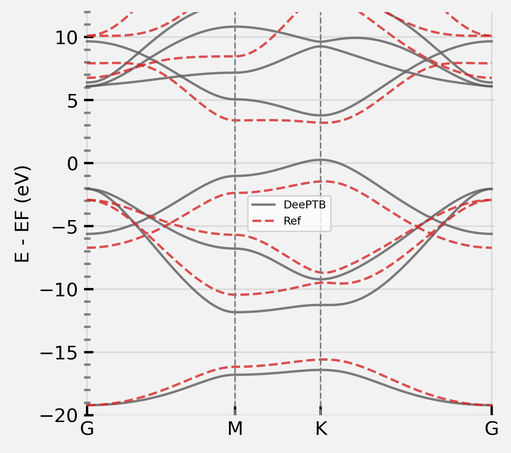
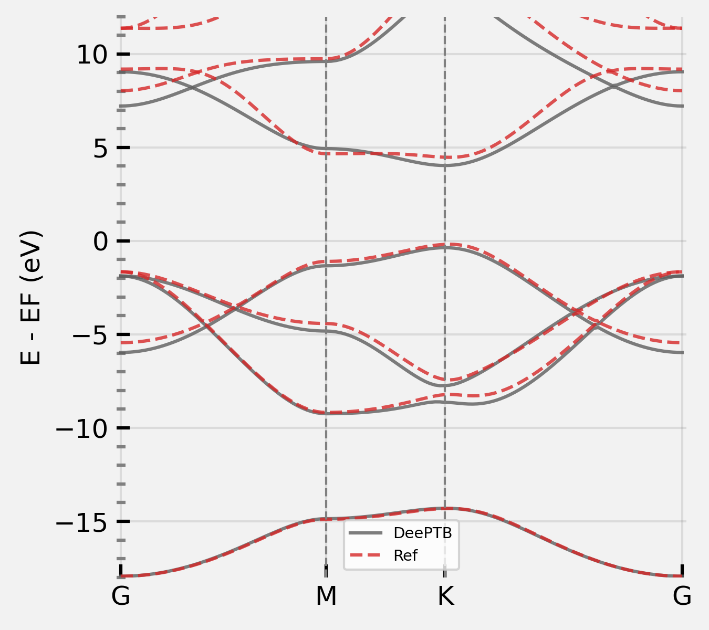
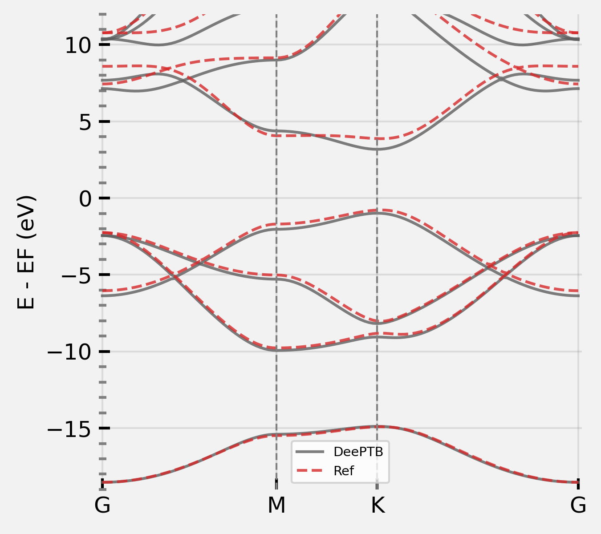

**DeePTB** is a Python package for tight-binding model. It has a few highlight features:
- Slater Koster like parameterization with a wide range of functions.
- Environmental correction with symmetry preserving neural networks.
- Efficient gradient-based fitting algorithm from autograd implementation.

The full document can be found in [readthedoc page](https://deeptb-doc.readthedocs.io/en/latest/index.html).

- [1. **installation**](#1-installation)
- [2. **Example: hBN**](#2-example-hbn)
- [3. **Getting Started**](#3-traing-tb-hamiltonian)
    - [3.1 **Data**:](#31-data)
    - [3.2 **input**](#32-input)
    - [3.3 **Training**](#33-training)
    - [3.4 **Testing**](#34-testing)
    - [3.5 **Processing**](#35-processing)
- [4. **Gallary**](#4-gallary)

# 1. **installation**
## **From Source**
If you are installing from source, you will need:

- Python 3.8 or later
- torch 1.13.0 or later, following the instruction on [PyTorch: Get Started](https://pytorch.org/get-started/locally) if GPU support is required, otherwise this can be installed with the building procedure.
- ifermi (optional, install only when 3D fermi-surface plotting is needed.)

First clone or download the source code from website.
Then, located to the repository root and running ```pip install .```

## **From Pypi**

## **From Conda**

# 2. **Example: hBN.**
hBN is a binary coumpond made of equal numbers of boron (B) and nitrogen (N), we present this as a quick hands-on example. The prepared files are located in:
```
deeptb/examples/hBN
-- data/set.0/
-- -- bandinfo.json
-- -- xdat.traj
-- -- kpoints.npy
-- -- eigs.npy
-- run/
-- input_short.json
```
The ```input_short.json``` file contains the least numbers of parameters that required to start training the **DeePTB** model. ```data``` folder contains the bandstructure data ```set.0```, where another important configuration file ```bandinfo.json``` is located.

The data file and input parameter will be introduced later, now having these files, we can start training our first **DeePTB** model by:
```bash
dptb train -sk input_short.json -o ./first
```
Here ``-sk`` indicate to fit the sk like parameters, and ``-o`` indicate the output directory. During the fitting procedure, we can see the loss curve of hBN is decrease consistently. When finished, we get the fitting results in folders ```first```:
```
first/
-- checkpoint/
-- -- best_nnsk_c1.5w0.3.json
-- -- best_nnsk_c1.5w0.3.pth
-- -- latest_nnsk_c1.5w0.3.json
-- -- latest_nnsk_c1.5w0.3.pth
-- log/
-- -- log.txt
-- train_config.json
```
Here checkpoint saves our fitting files, where best indicate the one in fitting procedure which has lowest validation loss. The latest is the most recent results.
we can plot the fitting bandstructure as:
```bash
cp run/band.json ./
dptb run -sk band.json -o ./band -i ./first/checkpoint/best_nnsk_c1.5w0.3.pth
```
``-i`` states initialize the model from the checkpoint file `./first/checkpoint/best_nnsk_c1.5w0.3.pth`. results will be saved in directory `band/`:
```
band/
-- log/
-- -- log.txt
-- results/
-- -- band.png
-- -- bandstructure.npy
```
Where `band.png` is the bandstructure of the trained model. Which looks like (left):
<div align=center>


</div>

It shows that the fitting has learn the shape of the bandstructure, but not very accurate. We can further improve the accuracy by incooperating more function, for example the onsite correction. There are three kind of onsite correction supported: `uniform` and `strain`. We use `strain` for now to see the effect. Now change the `onsitemode` in `input_sort.json` from `none` to `strain`, `num_epoch` to `400` and using the command:
```bash
dptb train -sk input_short.json -o ./first -i ./first/checkpoint/best_nnsk_c1.5w0.3.pth
```
After training finished, plot the result again and see (above right):

It already looks good, we can further improve the accuracy by adding more neighbours, or more orbitals, and training for longer time. Here we gives our very accurate fitting of both conduction and valance bands:
<div align=center>

</div>

Now you have learnt the basis use of **DeePTB**, however, the advanced functions are still need to be explored for accurate and flexible electron structure representation, such as:
- environmental correction
- onsite corrections
- atomic orbitals
- spin-orbit coupling (SOC)
- ...

Altogether, we can simulate the electronic structure of a crystal system in a dynamic trajectory. **DeePTB** is capable of handeling atom movement, volume change under stress, SOC effect and can using DFT eigenvalues with differnet orbitals and xc functionals as training target. More results can be found in the [Gallary](#4-gallary).


# 3. **Getting Started.**

## 3.1 **Data**
The dataset of one structure is recommended to prepare as following format:
```
data/
-- set.x
-- -- eigs.npy         # numpy array of shape [num_frame, num_kpoint, num_band]
-- -- kpoints.npy      # numpy array of shape [num_kpoint, 3]
-- -- xdat.traj        # ase trajectory file with num_frame
-- -- bandinfo.json    # defining the training objective of this bandstructure
```
One should prepare the **atomic structures** and **electronic band structures**. The **atomic structures** data are saved the format of ASE traj binary format, where each structure are stored using an **Atom** class defined in ASE package. The **band structures** data contains the kpoints list and eigenvalues are in the binary format of npy. The shape of kpoints data is **[num_kpoint,3]** and eigenvalues is **[num_frame,nk,nbands]**. nsnaps is the number of snapshots, nk is the number of kpoints and nbands is the number of bands.

### **Bandinfo**

`bandinfo.json` defines the settings of the training objective of each structure, basicly you can have specific settings for different structure, which allow training across structures across diffrent atom number and atom type.

The **bandinfo.json** file looks like:
```bash
{
    "band_min": 0,
    "band_max": 4,
    "emin": null, # minimum of fitting energy window
    "emax": null, # maximum of fitting energy window
    "weight": [1] # optional, indicating the weight for each band seperatly
}
```
**note:** the `0` energy point is located at the lowest energy eigenvalues of the data files, to generalize bandstructure data compute by different DFT packages.

## 3.2 **input**
**DeePTB** probide input config templete for quick setup. User can run:
```bash
dptb config <generated input config path> [-full]
```
The templete config file will be generated at the path `./input.json`.
For full document about the input parameters, we refer to the detail [document](https://deeptb-doc.readthedocs.io/en/latest/index.html). For now, we only need to consider a few vital parameters that can setup the training:

```json
"common_options": {
    "onsitemode": "none",
    "bond_cutoff": 3.2,
    "atomtype": ["A","B"],
    "proj_atom_anglr_m": {
        "A": ["2s","2p"],
        "B": ["2s","2p"]
    }
}
```
We can get the bond cutoff by `DeePTB`'s bond analysis function, using:
```bash
dptb bond <structure path> [[-c] <cutoff>] [[-acc] <accuracy>]
```

```json
"model_options": {
    "skfunction": {
        "sk_cutoff": 3.5,
        "sk_decay_w": 0.3,
    }
}
```

```json
"data_options": {
    "use_reference": true,
    "train": {
        "batch_size": 1,
        "path": "./data",
        "prefix": "set"
    },
    "validation": {
        "batch_size": 1,
        "path": "./data",
        "prefix": "set"
    },
    "reference": {
        "batch_size": 1,
        "path": "./data",
        "prefix": "set"
    }
}
```

## 3.3 **Training**
When data and input config file is prepared, we are ready to train the model.
To train a neural network parameterized Slater-Koster Tight-Binding model (nnsk) with Gradient Based Optimization method, we can run:
```bash
dptb train -sk <input config> [[-o] <output directory>] [[-i|-r] <nnsk checkpoint path>]
```
For training a environmental dependent Tight-Binding model (dptb), we can run:
```bash
dptb train <input config> [[-o] <output directory>] [[-i|-r] <dptb checkpoint path>]
```
But the suggested procedure is first train a nnsk model, and use environment dependent neural network as a correction, as proposed in our paper: xxx:
```bash
dptb train <input config> -crt <nnsk checkpoint path> [[-o] <output directory>]
```

## 3.4 **Testing**
After the model is converged, the testing function can be used to do the model test, or compute the eigenvalues for other analysis. 

Test config is just attained by a little modification of the train config. 
Delete the `train_options` since it is not useful when testing the model. And we delete all lines contains in `data_options`, and add the `test` dataset config:
```json
"test": {
    "batch_size": 1,  
    "path": "./data", # dataset path
    "prefix": "set"   # prefix of the data folder
}
```
Then we can run:
```bash
dptb test [-sk] <test config> -i <nnsk/dptb checkpoint path> [[-o] <output directory>]
```
## 3.5 **Processing**
**DeePTB** integrates multiple post processing functionalities in `dptb run` command, includesincludes:
- band structure plotting
- density of states plotting
- fermi surface plotting
- slater-koster parameter transcription

Please see the templete config file in `examples/hBN/run/`, and the running command is:
```bash
dptb run [-sk] <run config> [[-o] <output directory>] -i <nnsk/dptb checkpoint path> [[-crt] <nnsk checkpoint path>]
```

For detail document, please see our [Document page](https://deeptb-doc.readthedocs.io/en/latest/index.html).

# 4. **Gallary**
Will be added later when the paper is ready.