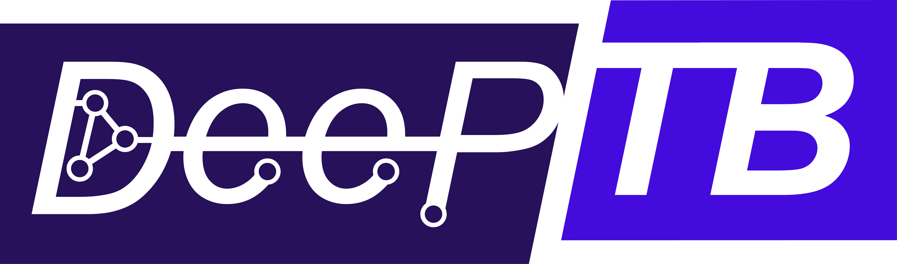

<p align="center">
    
</p>
<!-- <h1 align="center">DeePTB</h1> -->

<!--# DeePTB -->
<p align="center">
 <a href="https://github.com/deepmodeling"></a>
 <a href="https://github.com/deepmodeling/DeePTB/actions/workflows/image.yml"></a>
 <a href="https://github.com/deepmodeling/DeePTB/actions/workflows/unit_test.yml"></a>
 <a href="https://pypi.org/project/dptb/"></a>
 <a href="https://github.com/deepmodeling/DeePTB/blob/main/LICENSE"></a>
</p>

<!--
[](https://github.com/deepmodeling)
[](https://github.com/deepmodeling/DeePTB/actions/workflows/image.yml)
[](https://github.com/deepmodeling/DeePTB/actions/workflows/unit_test.yml)
-->

## 🚀 About DeePTB
DeePTB is an innovative Python package that uses deep learning to accelerate *ab initio* electronic structure simulations. It offers versatile, accurate, and efficient simulations for a wide range of materials and phenomena. Trained on small systems, DeePTB can predict electronic structures of large systems, handle structural perturbations, and integrate with molecular dynamics for finite temperature simulations, providing comprehensive insights into atomic and electronic behavior.

- **Key Features**
DeePTB contains two main components:
  1. **DeePTB-SK**: deep learning based local environment dependent Slater-Koster TB.
      - Customizable Slater-Koster parameterization with neural network corrections for .
      - Flexible basis and exchange-correlation functional choices.
      - Handle systems with strong spin-orbit coupling (SOC) effects.

  2. **DeePTB-E3**: E3-equivariant neural networks for representing quantum operators.
      - Construct DFT Hamiltonians/density and overlap matrices under full LCAO basis.
      - Utilize (**S**trictly) **L**ocalized **E**quivariant **M**essage-passing (**(S)LEM**) model for high data-efficiency and accuracy.
      - Employs SO(2) convolution for efficient handling of higher-order orbitals in LCAO basis.


For more details, see our papers:
- [DeePTB-SK: Nat Commun 15, 6772 (2024)](https://doi.org/10.1038/s41467-024-51006-4)
- [DeePTB-E3: ICLR 2025 Spotlight](https://openreview.net/forum?id=kpq3IIjUD3)


## 📚 Documentation

- **Online documentation**

    For a comprehensive guide and usage tutorials, visit [Documentation website](https://deeptb.readthedocs.io/en/latest/).

- **Contributing**

    We welcome contributions to DeePTB. Please refer to our [contributing guidelines](https://deeptb.readthedocs.io/en/latest/community/contribution_guide.html) for details.


## 🛠️ Installation

Installing **DeePTB** is straightforward with UV, a fast Python package manager.

- **Requirements**
  - Git
  - Python 3.10 to 3.13
  - UV, the recommended installer frontend
  - For GPU installs: an NVIDIA driver compatible with the selected CUDA runtime

- **From Source** (Recommended)

  1. **Install UV** (if not already installed):
     ```bash
     # On macOS and Linux
     curl -LsSf https://astral.sh/uv/install.sh | sh

     # Or using pip
     pip install uv

     # On Windows (PowerShell)
     powershell -c "irm https://astral.sh/uv/install.ps1 | iex"
     ```

  2. **Clone DeePTB**:
     ```bash
     git clone https://github.com/deepmodeling/DeePTB.git
     cd DeePTB
     ```

  3. **Install DeePTB with tested dependencies**:

     **Automatic CPU/GPU selection**:
     ```bash
     ./install.sh
     ```

     **CPU-only install**:
     ```bash
     ./install.sh cpu
     ```

     **GPU install**:
     ```bash
     nvidia-smi  # check the driver-reported CUDA version
     ./install.sh gpu    # auto-detect CUDA backend

     # Or force a tested CUDA wheel path:
     ./install.sh cu128  # RTX 50 / CUDA 12.8 path tested with torch 2.10.0
     ./install.sh cu130  # requires a driver new enough for CUDA 13.0 runtime
     ```

     This single command will:
     - Automatically create a virtual environment (`.venv`)
     - Install a tested PyTorch / PyG / `torch-scatter` binary-wheel combination
     - Refuse unsupported Python or CUDA/backend combinations instead of falling back to source builds
     - Install all runtime and test dependencies

  4. **Validate the installation**:
     DeePTB is under active development, so new installations should run the
     test suite once before production use.

     ```bash
     .venv/bin/python -m pytest ./dptb/tests/
     ```

     For a faster local check while iterating:

     ```bash
     .venv/bin/python -m pytest ./dptb/tests/ -m "not slow"
     ```

  5. **Install optional dependencies** (if needed):
     ```bash
     # For 3D Fermi surface plotting
     ./install.sh auto --extra 3Dfermi

     # For TBtrans initialization
     ./install.sh auto --extra tbtrans_init

     # For pybinding support
     ./install.sh auto --extra pybinding
     ```

  6. **Run DeePTB**:
     ```bash
     source .venv/bin/activate  # On Unix/macOS
     .venv\Scripts\activate     # On Windows
     dptb --help
     ```

- **Developer Install**

  `pyproject.toml` declares the broader source-compatible range
  (`Python >=3.10,<3.14`, `torch >=2.5.1,<=2.12.1`). Developers who already
  manage their own Torch/PyG environment can still use:

  ```bash
  uv sync
  ```

  For new machines, prefer `install.sh` because it selects a tested
  `torch-scatter` binary wheel for the requested CPU/GPU backend.

- **Easy Installation** (PyPI)

  > [!WARNING]
  > PyPI installation requires a compatible PyTorch and `torch-scatter` binary
  > wheel to be installed first. The source install path above is easier for new
  > machines.

  **For CPU**:
  ```bash
  # 1. Install torch_scatter matching the tested CPU Torch version
  pip install torch-scatter -f https://data.pyg.org/whl/torch-2.12.1+cpu.html

  # 2. Install DeePTB
  pip install dptb
  ```

  **For GPU** (example with CUDA 12.8 / RTX 50):
  ```bash
  # 1. Install torch with CUDA support.
  pip install torch==2.10.0 --index-url https://download.pytorch.org/whl/cu128

  # 2. Install torch_scatter matching the Torch/CUDA pair.
  pip install torch-scatter -f https://data.pyg.org/whl/torch-2.10.0+cu128.html

  # 3. Install DeePTB
  pip install dptb
  ```

  > [!TIP]
  > For easier installation with automatic GPU/CPU detection, use the **From Source** method above instead.

- **Julia Backend** (Optional - for High-Performance Pardiso Solver)

  > [!NOTE]
  > **Platform Support**: Pardiso backend currently supports **Linux only**.
  > - **macOS**: Not supported (Intel MKL limitations)
  > - **Windows**: Use WSL2 (Windows Subsystem for Linux)

  If you want to use the Pardiso backend for accelerated band structure calculations:

  **Automated Installation** (Recommended):
  ```bash
  ./install_julia.sh
  ```

  **Manual Installation**:
  1. Install Julia:
     ```bash
     # Linux (macOS can install Julia, but the Pardiso backend is not supported)
     curl -fsSL https://install.julialang.org | sh
     ```
  2. Install required packages:
     ```bash
     julia install_julia_packages.jl
     ```

  **Verify Installation**:
  ```bash
  julia -e 'using Pardiso; println("Pardiso available: ", Pardiso.MKL_PARDISO_LOADED[])'
  ```

  **Usage**:
  ```bash
  dptb pdso band.json -i model.pth -stu structure.vasp -o ./output
  ```

  For more details, see:
  - [Pardiso Backend README](dptb/postprocess/pardiso/README.md)
  - [Example Tutorial](examples/To_pardiso/README.md)

## Test code

To ensure the code is correctly installed, please run the unit tests first:
```bash
.venv/bin/python -m pytest ./dptb/tests/
```
Be careful if not all tests pass!

## 🤝 How to Cite

The following references are required to be cited when using DeePTB. Specifically:

- **For DeePTB-SK:**

    Q. Gu, Z. Zhouyin, S. K. Pandey, P. Zhang, L. Zhang, and W. E, Deep Learning Tight-Binding Approach for Large-Scale Electronic Simulations at Finite Temperatures with Ab Initio Accuracy, Nat Commun 15, 6772 (2024).

- **For DeePTB-E3:**

    Z. Zhouyin, Z. Gan, S. K. Pandey, L. Zhang, and Q. Gu, Learning Local Equivariant Representations for Quantum Operators, In The 13th International Conference on Learning Representations (ICLR) 2025.
