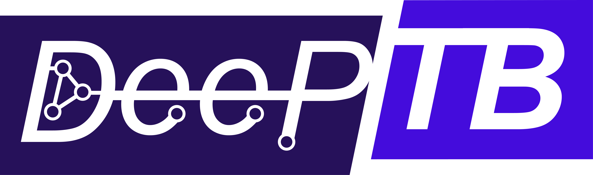

<p align="center">
    
</p>
<!-- <h1 align="center">DeePTB</h1> -->

<!--# DeePTB -->
<p align="center">
 <a href="https://github.com/deepmodeling"></a>
 <a href="https://github.com/deepmodeling/DeePTB/actions/workflows/image.yml"></a>
 <a href="https://github.com/deepmodeling/DeePTB/actions/workflows/unit_test.yml"></a>
 <a href="https://pypi.org/project/dptb/"></a>
 <a href="https://github.com/deepmodeling/DeePTB/blob/main/LICENSE"></a>
</p>

<!--
[](https://github.com/deepmodeling)
[](https://github.com/deepmodeling/DeePTB/actions/workflows/image.yml)
[](https://github.com/deepmodeling/DeePTB/actions/workflows/unit_test.yml)
-->

## 🚀 About DeePTB
DeePTB is an innovative Python package that uses deep learning to accelerate *ab initio* electronic structure simulations. It offers versatile, accurate, and efficient simulations for a wide range of materials and phenomena. Trained on small systems, DeePTB can predict electronic structures of large systems, handle structural perturbations, and integrate with molecular dynamics for finite temperature simulations, providing comprehensive insights into atomic and electronic behavior.

- **Key Features**
DeePTB contains two main components: 
  1. **DeePTB-SK**: deep learning based local environment dependent Slater-Koster TB.
      - Customizable Slater-Koster parameterization with neural network corrections for . 
      - Flexible basis and exchange-correlation functional choices.
      - Handle systems with strong spin-orbit coupling (SOC) effects.

  2. **DeePTB-E3**: E3-equivariant neural networks for representing quantum operators.
      - Construct DFT Hamiltonians/density and overlap matrices under full LCAO basis.
      - Utilize (**S**trictly) **L**ocalized **E**quivariant **M**essage-passing (**(S)LEM**) model for high data-efficiency and accuracy.
      - Employs SO(2) convolution for efficient handling of higher-order orbitals in LCAO basis.


For more details, see our papers:
- [DeePTB-SK: Nat Commun 15, 6772 (2024)](https://doi.org/10.1038/s41467-024-51006-4)
- [DeePTB-E3: ICLR 2025 Spotlight](https://openreview.net/forum?id=kpq3IIjUD3)


## 📚 Documentation

- **Online documentation**
  
    For a comprehensive guide and usage tutorials, visit [Documentation website](https://deeptb.readthedocs.io/en/latest/).

- **Contributing**

    We welcome contributions to DeePTB. Please refer to our [contributing guidelines](https://deeptb.readthedocs.io/en/latest/community/contribution_guide.html) for details.


## 🛠️ Installation

Installing **DeePTB** is straightforward. We recommend using a virtual environment for dependency management.

- **Requirements**
  - Git
  - Python 3.9 to 3.12.
  - Torch 2.0.0 to 2.5.1 ([PyTorch Installation](https://pytorch.org/get-started/locally)).
  - ifermi (optional, for 3D fermi-surface plotting).
  - TBPLaS (optional).

- **From Source** 
  
    Highly recommended to install DeePTB from source to get the latest features and bug fixes.
  1. **Setup Python environment**:
        Using conda (recommended, python >=3.9, <=3.12 ), e.g.,
        ```bash
        conda create -n dptb_venv python=3.10
        conda activate dptb_venv
        ```
        or using venv (make sure python >=3.9,<=3.12)
    
        ```bash
        python -m venv dptb_venv
        source dptb_venv/bin/activate
        ```

  2. **Clone DeePTB and  Navigate to the root directory**:
        ```bash
        git clone https://github.com/deepmodeling/DeePTB.git
        cd DeePTB
        ```

  3. **Install `torch`**:
        ```bash
        pip install "torch>=2.0.0,<=2.5.0"
        ```
  4. **Install `torch-scatter`** (two ways):
        - **Recommended**: Install torch and torch-scatter using the following commands:
            ```bash
            python docs/auto_install_torch_scatter.py
            ```
        - **Manual**: Install torch and torch-scatter manually:
            ```bash
            pip install torch-scatter -f https://data.pyg.org/whl/torch-${version}+${CUDA}.html
            ```
            where `${version}` is the version of torch, e.g., 2.5.0, and `${CUDA}` is the CUDA version, e.g., cpu, cu118, cu121, cu124. See [torch_scatter doc](https://github.com/rusty1s/pytorch_scatter) for more details.   

  5. **Install DeePTB**:
        ```bash
        pip install .
        ```

- **Easy Installation**
  
  note: not fully tested, please use the source installation for a stable version.
  1. Using PyPi
  2. Ensure you have Python 3.9 to 3.12 and Torch installed.
  3. Install DeePTB with pip:
        ```bash
        pip install dptb
        ```

## Test code 

To ensure the code is correctly installed, please run the unit tests first:
```bash
pytest ./dptb/tests/
```
Be careful if not all tests pass!

## 🤝 How to Cite

The following references are required to be cited when using DeePTB. Specifically:

- **For DeePTB-SK:**

    Q. Gu, Z. Zhouyin, S. K. Pandey, P. Zhang, L. Zhang, and W. E, Deep Learning Tight-Binding Approach for Large-Scale Electronic Simulations at Finite Temperatures with Ab Initio Accuracy, Nat Commun 15, 6772 (2024).
  
- **For DeePTB-E3:**
  
    Z. Zhouyin, Z. Gan, S. K. Pandey, L. Zhang, and Q. Gu, Learning Local Equivariant Representations for Quantum Operators, In The 13th International Conference on Learning Representations (ICLR) 2025. 
