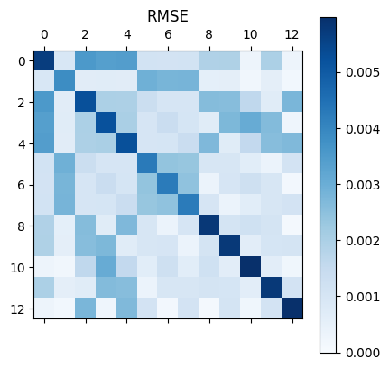
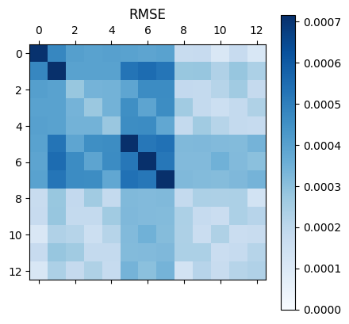

# Loss Analysis
## function
The **DeePTB** contrains a module to help the user better understand the details of the error of **E3TB** module.
We decompose the error of **E3TB** model into several parts:
- onsite blocks: for diagonal blocks of the predicted quantum tensors
    the onsite blocks are further arranged according to the atom species.
- hopping blocks: for off-diagonal blocks
    the hopping blocks error are then further arranged according to the atom-pair types.

## usage
For using this function, we need a dataset and the model. Just build them up in advance.
```Python
from dptb.data import build_dataset
from dptb.nn import build_model

dataset = build_dataset(
    root="your dataset root",
    type="DefaultDataset",
    prefix="frame",
    get_overlap=True,
    get_Hamiltonian=True,
    basis={"Si":"2s2p1d"}
    )

model = build_model("./ovp/checkpoint/nnenv.best.pth", common_options={"device":"cuda"})
model.eval()
```

Then, the user should sample over the dataset using the dataloader and doing a analysis with running average, the code looks like:
```Python
import torch
from dptb.nnops.loss import HamilLossAnalysis
from dptb.data.dataloader import DataLoader
from tqdm import tqdm
from dptb.data import AtomicData

ana = HamilLossAnalysis(idp=model.idp, device=model.device, decompose=True, overlap=True)

loader = DataLoader(dataset, batch_size=10, shuffle=False, num_workers=0)

for data in tqdm(loader, desc="doing error analysis"):
    with torch.no_grad():
        ref_data = AtomicData.to_AtomicDataDict(data.to("cuda"))
        data = model(ref_data)
        ana(data, ref_data, running_avg=True)
```
The analysis results are stored in `ana.stats`, which is a dictionary of statistics. The user can checkout the value directly, or displaying the results by:

```Python
ana.report()
```
Here is an example of the output:
```
TOTAL:
MAE: 0.00012021172733511776
RMSE: 0.00034208124270662665


Onsite: 
Si:
MAE: 0.0012505357153713703
RMSE: 0.0023699181620031595
```



```
Hopping: 
Si-Si:
MAE: 0.00016888207755982876
RMSE: 0.0003886453341692686
```



If the user want to see the loss in a decomposed irreps format, one can set the `decompose` of `HamilLossAnalysis` class to `True`, and rerun the analysis.  We can display the decomposed irreps results using the following code:
```Python
import matplotlib.pyplot as plt
import torch

ana_result = ana.stats

for bt, err in ana_result["hopping"].items():
    print("rmse err for bond {bt}: {rmserr} \t mae err for bond {bt}: {maerr}".format(bt=bt, rmserr=err["rmse"], maerr=err["mae"]))

for bt, err in ana_result["onsite"].items():
    print("rmse err for atom {bt}: {rmserr} \t mae err for atom {bt}: {maerr}".format(bt=bt, rmserr=err["rmse"], maerr=err["mae"]))

for bt, err in ana_result["hopping"].items():
    x = list(range(model.idp.orbpair_irreps.num_irreps))
    rmserr = err["rmse_per_irreps"]
    maerr = err["mae_per_irreps"]
    sort_index = torch.LongTensor(model.idp.orbpair_irreps.sort().inv)
    
    # rmserr = rmserr[sort_index]
    # maerr = maerr[sort_index]
    
    plt.figure(figsize=(20,3))
    plt.bar(x, rmserr.cpu().detach(), label="RMSE per rme")
    plt.bar(x, maerr.cpu().detach(), alpha=0.6, label="MAE per rme")
    plt.legend()
    # plt.yscale("log")
    # plt.ylim([1e-5, 5e-4])
    plt.title("rme specific error of bond type: {bt}".format(bt=bt))
    plt.show()

for at, err in ana_result["onsite"].items():
    x = list(range(model.idp.orbpair_irreps.num_irreps))
    rmserr = err["rmse_per_irreps"]
    maerr = err["mae_per_irreps"]
    sort_index = torch.LongTensor(model.idp.orbpair_irreps.sort().inv)

    rmserr = rmserr[sort_index]
    maerr = maerr[sort_index]

    plt.figure(figsize=(20,3))
    plt.bar(x, rmserr.cpu().detach(), label="RMSE per rme")
    plt.bar(x, maerr.cpu().detach(), alpha=0.6, label="MAE per rme")
    plt.legend()
    # plt.yscale("log")
    # plt.ylim([1e-5, 2.e-2])
    plt.title("rme specific error of atom type: {at}".format(at=at))
    plt.show()

```