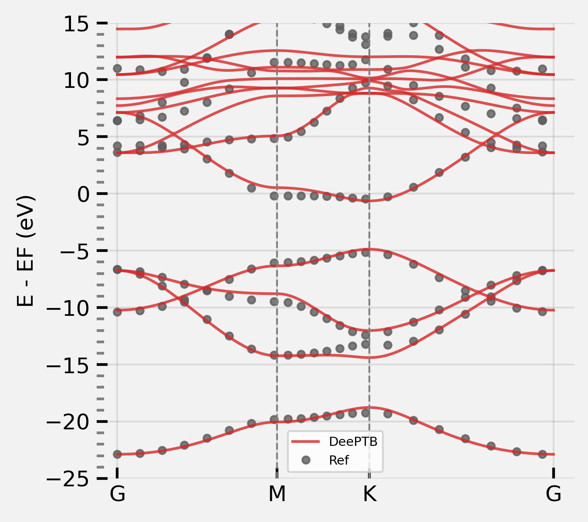
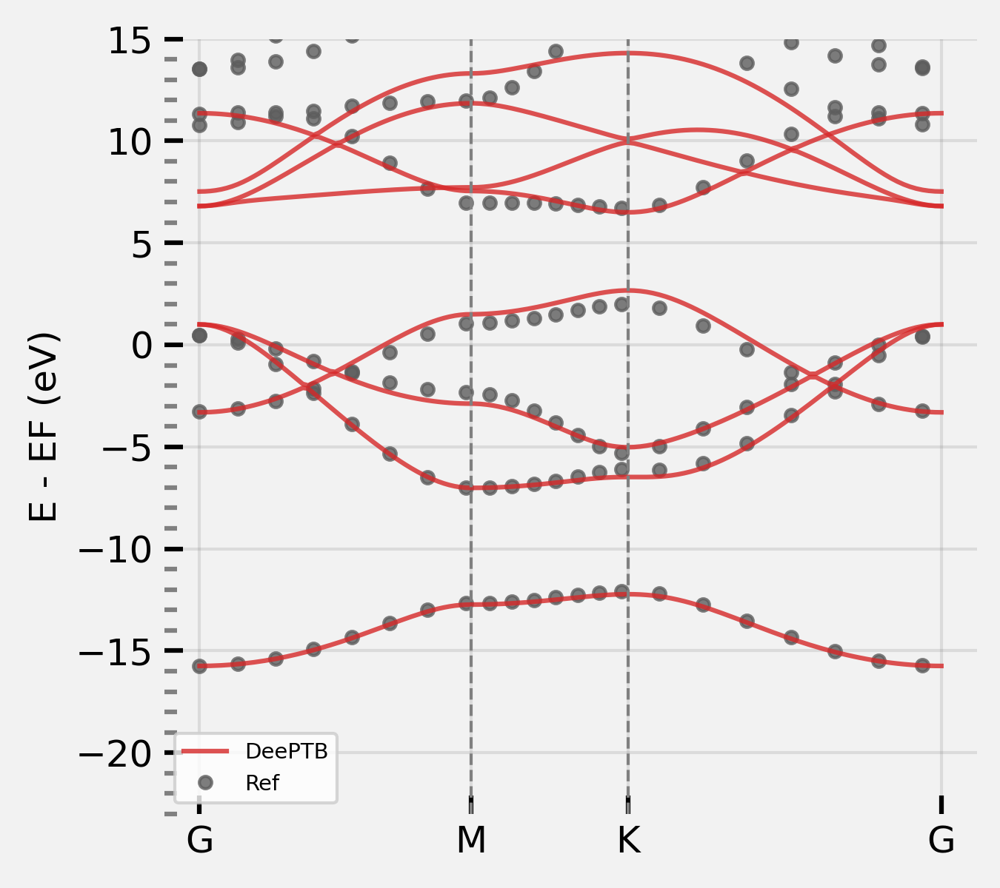
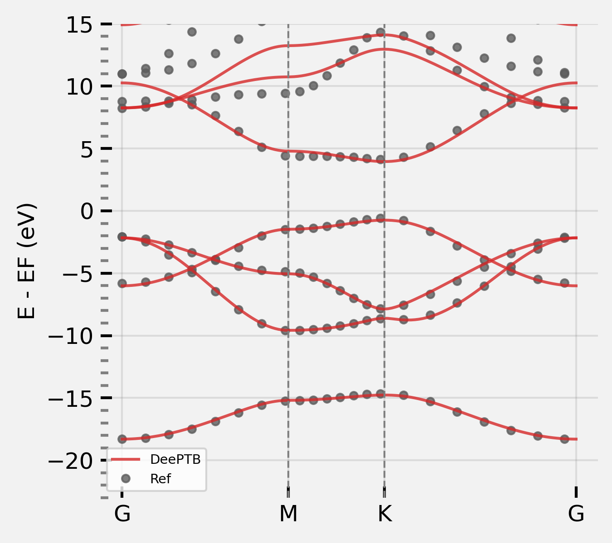
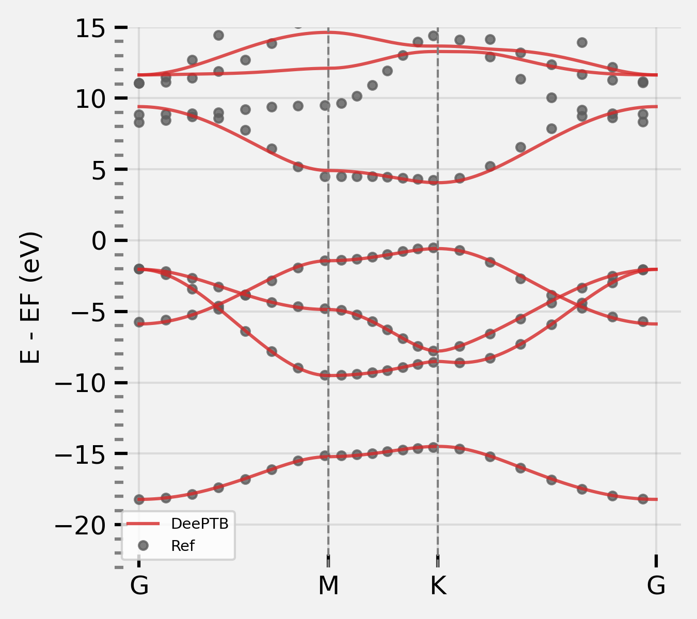

# A quick Example

## h-BN model

DeePTB is a package that utilizes machine-learning method to train TB models for target systems with the DFT training data. Here, h-BN monolayer has been chosen as a quick start example. 

hBN is a binary compound made of equal numbers of boron (B) and nitrogen (N), we present this as a quick hands-on example. The prepared files are located in:
```
deeptb/examples/hBN/
-- data/kpath.0/
-- -- info.json
-- -- xdat.traj
-- -- kpoints.npy
-- -- eigenvalues.npy
-- input/
-- -- 1_start.json
-- -- 2_strain.json
-- -- 3_varycutoff.json
-- -- 4_longtrain.json
-- run/
-- -- band.json
-- input_short.json
-- plot_band.py
```
The ```input_short.json``` file contains the least number of parameters that are required to start training the **DeePTB** model. ```data``` folder contains the bandstructure data ```kpath.0```, where another important configuration file ```info.json``` is located.

First we need to specify the maximum cutoff in building the AtomicData graph in `info.json`. Here, we set the `r_max` large enough to contain the 3rd neighbour. This can be assisted by running `dptb bond` command:

```bash
cd deeptb/examples/hBN/data
# to see the bond length
dptb bond struct.vasp  
# output:
Bond Type         1         2         3         4         5
------------------------------------------------------------------------
       N-N      2.50      4.34      5.01
       N-B      1.45      2.89      3.82      5.21      5.78
       B-B      2.50      4.34      5.01
```

Having the data file and input parameter, we can start training our first **DeePTB** model from scratch. The first step using the parameters defined in ```input_short.json``` and we list some important parameters:
```json
 "common_options": {
            "basis": {
                "B": ["2s", "2p"],
                "N": ["2s", "2p"]
            },
            "device": "cpu",
            "dtype": "float32",
            "overlap": false,
            "seed": 120478
    }
    
"model_options": {
    "nnsk": {
            "onsite": {"method": "none"},
            "hopping": {"method": "powerlaw", "rs":1.6, "w":0.3},
            "freeze": false
        }
    }
```
We are training a **DeePTB** model using Slater-Kohster parameterization, so we need to build the `nnsk` model here. The `method` of  ```onsite``` is set to ```none```, which means we do not use onsite correction. The ```rs``` of `hopping` is set to ```1.6``` which means we use the 1st nearest neighbour for building hopping integrals for now. The ```basis``` for each element is set to ```2s``` and ```2p``` which means we use $2s$ and $2p$ orbitals as basis. 

Since we are using only the valence orbitals at this stage, we can limit the energy window for training in the dataset configuration file ```info.json``` as the follwing:

```json
    "bandinfo": {
        "band_min": 0,
        "band_max": 6,
        "emin": -0.1,
        "emax": 20.0
    }
```

Using the follwing command and we can train the first model:

```bash
cd deeptb/examples/hBN
dptb train input_short.json -o ./first
```

Here ``-o`` indicate the output directory. During the fitting procedure, we can see the loss curve of hBN is decrease consistently. When finished, we get the fitting results in folders ```first```.

By modify the checkpoint path in the script `plot_band.py` and running it, the band structure can be obtained in `./band_plot`:
```bash
python plot_band.py
```
> Note: the ```basis``` setting in the plotting script must be the same as in the input.


It shows that the fitting has learned the rough shape of the valence bandstructure. To fit the conduction bandstructure, we need to add extra polarized orbitals to the atoms. The polarized orbitals can be added in the `input.json` by modifying the ```basis``` setting:

```json
    "basis": {
        "B": ["2s", "2p", "d*"],
        "N": ["2s", "2p", "d*"]
        }
``` 

To train the conduction band, the energy window we previously set in `info.json` can now be discarded by setting ```emin``` and ```emax``` to ```null```.

```json
    "bandinfo": {
        "band_min": 0,
        "band_max": 6,
        "emin": null,
        "emax": null
    }
```

We can then start the training using the previous model and modified input:
```bash
dptb train input_short.json -i ./first/checkpoint/nnsk.ep1001.pth -o ./condband
```
``-i`` states initialize the model from the checkpoint file, where the previous model is provided.

> The modified input files are provided in `./inputs` as references.

After the training is finished, you can get the result in `condband` folder.

After training, we can plot the bandstructure again using the script:



We can further improve the accuracy by incorporating more features of our code, for example, the onsite correction. There are two kinds of onsite correction supported: `uniform` or `strain`. We use `strain` for now to see the effect. Now change the `input_short.json` by the parameters:
```json
    "model_options": {
        "nnsk": {
            "onsite": {"method": "strain", "rs":1.6, "w":0.3},
            "hopping": {"method": "powerlaw", "rs":1.6, "w": 0.3},
            "freeze": false
        }
    }
```

After setting we can run the training for strain model:

```bash
dptb train input_short.json  -i ./condband/checkpoint/nnsk.ep1001.pth -o ./strain
```

We can also plot the band structure of the strain model:



It looks ok, we can further improve the accuracy by adding more neighbours, and training for a longer time. We can gradually increase the decay function cutoff `rs` from 1st to 3rd neighbour. This can be done by changing the `model_options` in the `input_short.json` as follow:

```json
    "model_options": {
        "nnsk": {
            "onsite": {"method": "strain", "rs":1.6, "w":0.3},
            "hopping": {"method": "powerlaw", "rs":1.6, "w": 0.3},
            "push": {"rs_thr": 0.02, "period": 10},
            "freeze": false
        }
    }
```
This means that we gradually add up the `rs` in decay function, pushing up to 3rd nearest neighbour for considering in calculating bonding. see the input file `hBN/input/3_varycutoff.json` for detail. Then we can run the training again:

```bash
dptb train input_short.json  -i ./strain/checkpoint/nnsk.ep501.pth -o ./varycutoff
```

We finally get the model with more neighbors. We can plot the result again:



We can again increase more training epochs, using the larger cutoff checkpoint. This can be done simply by assigning a large `num_epoch` in `train_options`. 

And we can get a fairly good fitting result:



Now you have learned the basis use of **DeePTB**, however, the advanced functions still need to be explored for accurate and flexible electron structure representation, such as:
- atomic orbitals
- environmental correction
- ...

Altogether, we can simulate the electronic structure of a crystal system in a dynamic trajectory. **DeePTB** is capable of handling atom movement, volume change under stress, SOC effect and can use DFT eigenvalues with different orbitals and xc functionals as training targets.