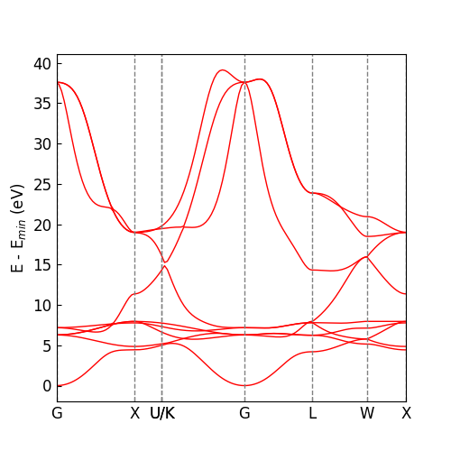

# Load from NRL-TB parameter.

1. download the NRL-TB file. here we show the example of Cu. ie. the Cu.par file
   
2. load the NRL-TB file.
    ```bash
    dptb n2j input_nrl.json -nrl Cu.par -o outdir
    ```
    Then in the outdir you can find the output files.
    ```bash
    outdir
    ├── input_nrl_auto.json
    └── nrl_ckpt.json
    ```
    The **`input_nrl_auto.json`** is the  input file, where the parameters such as `sk_cutoff`,  `sk_decay_w`, `onsite_func_lambda`. etc. are uptated according to the NRL file.  The **`nrl_ckpt.json`** is the obtained checkpoint file, which can be used for the following calculation.
    
3. we supported the `plotband.ipynb` note-book. you can just modify the cell to input the model and the checkpoint file, then you can plot the band structure. 
   
    
