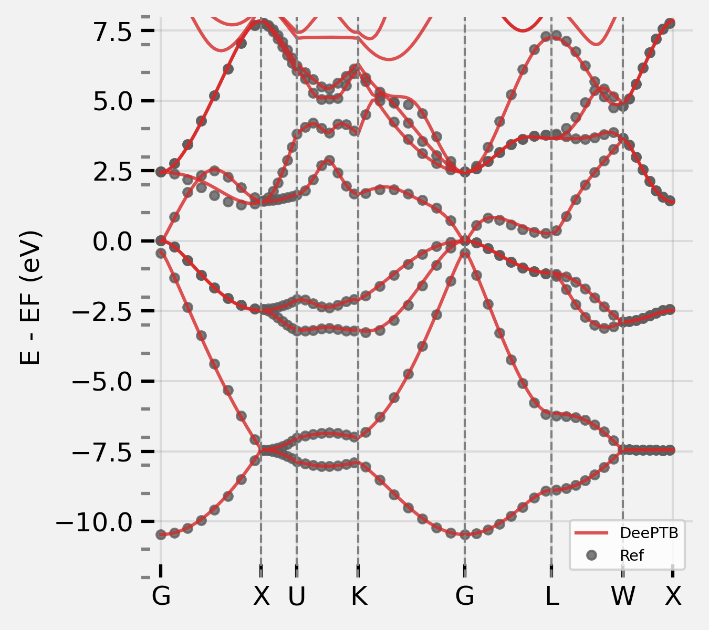
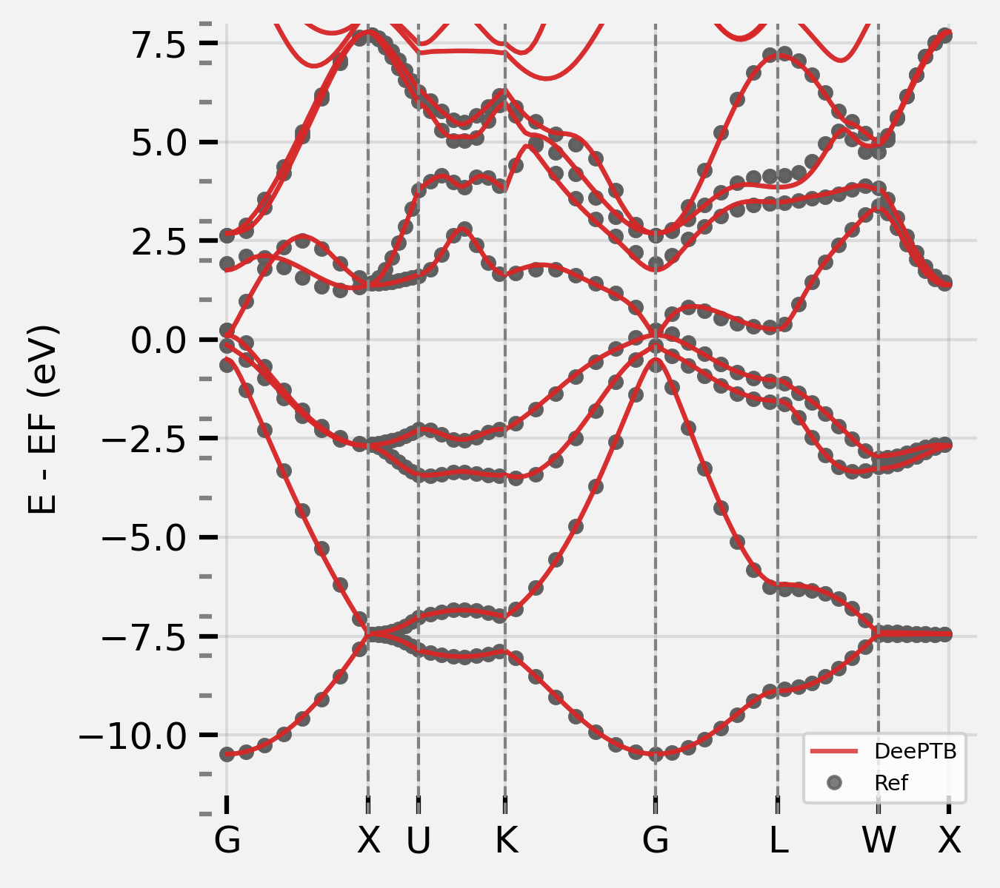

# Tutorial for training TB with SOC effect for alpha-Sn material. 

## Training data
The training data is generated by the ABACUS code. The training data is stored in the `data` folder. The `data` folder contains the following files:

- `non_soc`: folder contains the band structure and training data for the non-soc case.
- `soc`: folder contains the band structure and training data for the soc case.
  
Inside of the `non_soc` and `soc` folder, the following files are included:
- `BANDS_1.dat`: the band structure data generated by the ABACUS code.
- `Sn.vasp`: the structure file of the alpha-Sn material.
- `ref_eig_band.npy`: the reference band structure data, read from `BANDS_1.dat` by removing the core electronic bands. 
- `set.0`: the training data with dense k points.
- `set_sparseK.0`: the training data with sparse k points. usually, the sparse k points are used for the training data. 


```shell
data
|-- non_soc
|   |-- BANDS_1.dat
|   |-- Sn.vasp
|   |-- ref_eig_band.npy
|   |-- set.0
|   |   |-- bandinfo.json
|   |   |-- eigs.npy
|   |   |-- kpoints.npy
|   |   `-- xdat.traj
|   `-- set_sparseK.0
|       |-- bandinfo.json
|       |-- eigs.npy
|       |-- kpoints.npy
|       `-- xdat.traj
`-- soc
    |-- BANDS_1.dat
    |-- Sn.vasp
    |-- ref_eig_band.npy
    |-- set.0
    |   |-- bandinfo.json
    |   |-- eigs.npy
    |   |-- kpoints.npy
    |   `-- xdat.traj
    `-- set_sparseK.0
        |-- bandinfo.json
        |-- eigs.npy
        |-- kpoints.npy
        `-- xdat.traj
```

## Training
### 1. train the non-soc model
This is already explained in other examples, here we just give a model checkpoint. one can just to visualize the band structure and compare with the reference band structure.  in the `reference` folder:

```shell
cd reference/non_soc
# run the command manually
dptb run -sk band.json  -i ./checkpoint/best_nnsk_c6.0w0.1.pth -o ./band
# or just type:
bash run.sh
```
This will generate the non-soc band structure in the `band`.
<div align=center>

</div>


### 2. train the soc model
in the `run` folder:

```shell
run
|-- band.json
|-- input.json
|-- nonsoc_model
|   |-- best_nnsk_c6.0w0.1.json
|   |-- best_nnsk_c6.0w0.1.pth
|   |-- latest_nnsk_c6.0w0.1.json
|   `-- latest_nnsk_c6.0w0.1.pth
|-- plot.sh
|-- plotband.ipynb
`-- train.sh
```

- `band.json`: the configuration file for ploting band structure.
- `input.json`: the configuration file for training.
- `nonsoc_model`: the folder contains the non-soc model checkpoint.
- `plot.sh`: the script for ploting band structure.
- `plotband.ipynb`: the jupyter notebook for ploting band structure.
- `train.sh`: the script for training the soc model.

For training: turn on soc in `input.json`
```json
"common_options": {
        ...
        ...
        "soc":true
    },
```
then run the command: 

```shell
bash train.sh
```
or 
```shell
dptb train input.json -sk -i ./nonsoc_model/best_nnsk_c6.0w0.1.pth -o ./soc_model
```

During the training you can monitor the training process by typing the command:
```shell
bash plot.sh
```
or 
```shell
dptb run -sk band.json -o ./band -i ./soc/checkpoint/best_nnsk_b6.000_c6.000_w0.100.pth
```
This will plot the band structure and save the results in the `band` folder.

Or you can use the jupyter notebook to plot the band structure.

In the reference,  we have already trained a soc model, you can just use it to plot the band structure. 

```shell
cd reference/soc
# run the command manually
dptb run -sk band.json -o ./band -i ./checkpoint/best_nnsk_c6.0w0.1.pth
# or just type:
bash run.sh
```
This will generate the soc band structure in the `band`.
<div align=center>

</div>