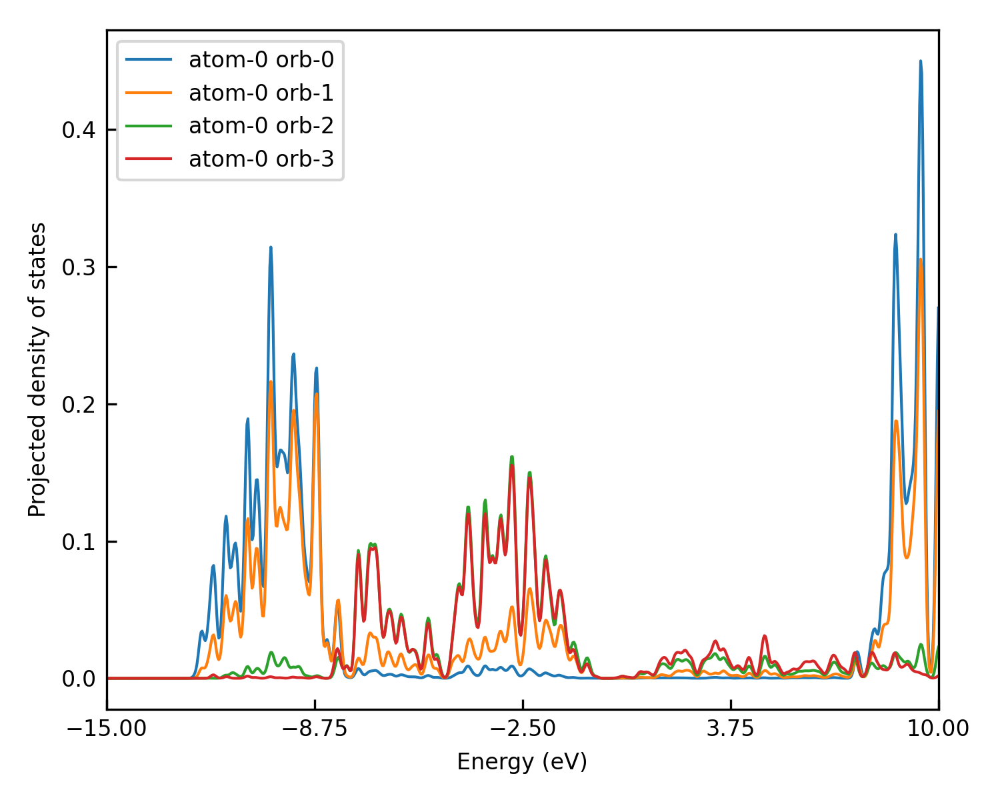
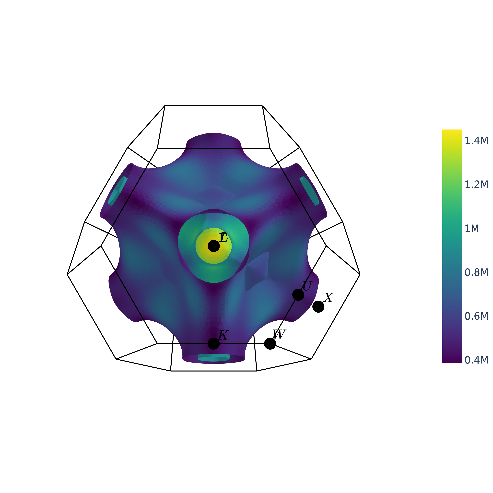
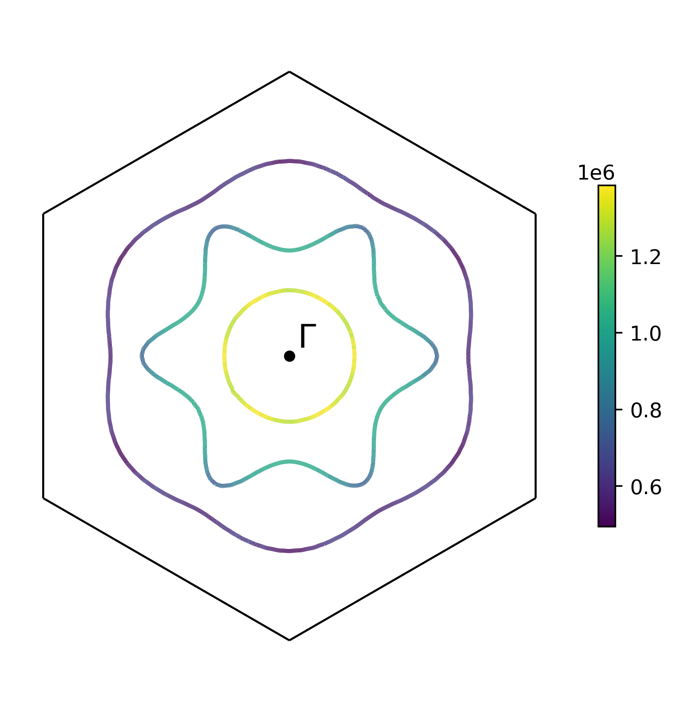

# **Example: Bulk Silicon.**
Bulk silicon has diamond structure at room temperature and pressure. Due to its widespread applications in the semiconductor industry, it has been a significant important element in modern society. Here we provide an example of building a silicon **DeePTB** model. By following this instruction step-by-step, you will be introduced to the high-level functionalities of **DeePTB**, which can provide a model bypass empirical TB, to achieve *ab initio* accuracy.

The whole training procedure can be summarized as below:

This procedure contains the full steps to training an environmentally corrected **DeePTB** model. The converged model can predict the electronic structure of both perfect crystals and the configurations with atomic distortion, while can generalize to structures with more atoms. For convenience, we provide all the training checkpoints in `ckpt`:
```bash
deeptb/examples/silicon/ckpt/
-- md/
-- -- 2-3-25K_best_nnsk_b5.000_c5.000_w0.100.pth # nnsk model trained on 25K MD trajectory
-- -- 2-3-100K_best_nnsk_b5.000_c5.000_w0.100.pth # nnsk model trained on 100K MD trajectory
-- -- 2-3-300K_best_dptb_b5.000_c5.000_w0.100.pth # nnsk model trained on 300K MD trajectory
-- -- 2-3-300K_best_nnsk_b5.000_c5.000_w0.100.pth # dptb model trained on 300K MD trajectory
-- 2-1_best_nnsk_b2.600_c2.600_w0.300.pth
-- 2-2-1_best_nnsk_b2.600_c2.600_w0.300.pth
-- 2-2-2_best_nnsk_b5.000_c5.000_w0.100.pth
```


## **1. Data Preparation**

The data for training and plotting contains in `data` folders:
```bash
deeptb/examples/silicon/data/
-- kpath.0/ # bandstructure of primary cell
-- kpathmd25.0/ # bandstructure of 10 MD snapshots at T=25K
-- kpathmd100.0/ # bandstructure of 10 MD snapshots at T=100K
-- kpathmd300.0/ # bandstructure of 10 MD snapshots at T=300K
-- kpt.0/ # kmesh samples of primary cell
-- silicon.vasp
```
Each of these folders, contains data files with required format, here we give an examples of `kpath.0`:
```bash
deeptb/examples/silicon/data/kpath.0/
-- bandinfo.json
-- eigs.npy
-- kpoints.npy
-- xdat.traj
```

## **2. Training Neural Network Emperical Tight-Binding Model (nnsk)**

### **2.1 Training a First Nearest Neighbour Model**
We first analyse the bond length by running.
```bash
dptb bond ./data/silicon.vasp
```
The output will be like:
```bash
 Bond Type         1         2         3         4         5
------------------------------------------------------------------------
     Si-Si      2.35      3.84      4.50      5.43      5.92
```

The fitting of empirical TB on the first nearest neighbours shares the same procedure as the `hBN` example. We suggest the user try on hBN before proceeding. This time, the training starts from the first nearest neighbour checkpoint in `ckpt` folders.

### **2.2 Add More Orbitals and Neighbours**
Let's plot the converged `nnsk` model in last step, using `band.json` in `run/`, by:

```bash
dptb run -sk run/band.json -i ./ckpt/2-1_best_nnsk_b2.600_c2.600_w0.300.pth -o ./band
```
The file `band.json` includes the parameters to plot the band structure. 
```json

{   
    "structure":"./data/silicon.vasp",
    "task_options": {
        "task": "band",
        "kline_type":"abacus",
        "kpath":[[0.0000000000,  0.0000000000,   0.0000000000,  50],   
                [0.5000000000,   0.0000000000,   0.5000000000,  50],               
                [0.6250000000,   0.2500000000,   0.6250000000,  1],    
                [0.3750000000,   0.3750000000,   0.7500000000,  50],     
                [0.0000000000,   0.0000000000,   0.0000000000,  50],    
                [0.5000000000,   0.5000000000,   0.5000000000,  50],                
                [0.5000000000,   0.2500000000,   0.7500000000,  50],               
                [0.5000000000,   0.0000000000,   0.5000000000,  1 ]
                ],
        "klabels":["G","X","X/U","K","G","L","W","X"],
        "E_fermi":-7.5,
        "emin":-12,
        "emax":12,
        "ref_band": "./data/kpath.0/eigs.npy"
    }
}
```
- `task`: the task to run, here we plot the band structure.
- `kline_type`: the type of kpath, here we use the abacus kpath.
- `kpath`: shape (:,4), here [:,:3] is the kpath, using the kpoints at the high symmetry points to define kpath, [:,3] is the number of kpoints in between two high symmetry points.
- `klabels`: the labels of high symmetry points.
- `E_fermi`: the fermi energy of the system.
- `emin`: the minimum energy of the band structure.
- `emax`: the maximum energy of the band structure.
- `ref_band`: the reference bandstructure, here we use the bandstructure of the primary cell calculated by abacus with the same kpath setting.

we can see, the fitted model has already captured the shape of the valance bands. However, the conductance band is less accurate since the orbitals `3s` and `3p` is not complete for the space spanned by the considered valance and conductance band. Therefore we need to include more orbitals in the model. 

<div align=center>

</div>

In **DeePTB**, users are able to add or remove orbitals by altering the input configuration file. Here we add `d*` orbital, which can permit us to fit the conductance band essential when calculating excitation properties such as photo-electronics and electronic transport.

First, we add `d*` in `proj_atom_anglr_m` of input configuration, which looks like this:
```json
"proj_atom_anglr_m": {
     "Si": [
          "3s",
          "3p",
          "d*"
     ]
}
```

Also, we need to change the learning-rate to `1e-3` to maintain stability in the first few iterations. Then, we start training the model with `-i/--init-model` of our last checkpoint, by running:
```bash
dptb train -sk ./ckpt/2-2-1_input.json -i ./ckpt/2-1_best_nnsk_b2.600_c2.600_w0.300.pth -o nnsk
```

In this way, the parameters in `nnsk` model corresponding to `3s` and `3p` orbitals can be reloaded. 
When convergence is achieved, we can plot the band structure, using the command:
```bash
dptb run -sk run/band.json -i ./ckpt/2-2-1_best_nnsk_b2.600_c2.600_w0.300.pth -o ./band
```
which shows that both the valance and conductance bands are fitted well:

<div align=center>

</div>

*Note: In practice, we find that training with the minimal basis set in begin, and then increasing the orbitals gradually is a better choice than directly training with full orbitals from scratch. This procedure can help to reduce the basis size and to improve the training stability.*

To further enhance the model, we can enlarge the cutoff range considered, to build a model beyond the first nearest neighbours. The parameters that control the cutoff radius: 
- `bond_cutoff` (angstrom unit): it indicates bonds that have a bond-length smaller than what is included.

We first increase the `bond_cutoff` to be larger than the bong-length of the third nearest neighbour, while shorter than the fourth. However, abrupt change in the cutoff will introduce discontinuity in the model training, we, therefore, introduce a smoothing function:
$$f_s(r)=\frac{1}{1+e^{(r-r_{skc})/\omega}}$$
 that is controlled by parameters:

- `sk_cutoff` (angstrom unit): $r_{skc}$ it controls the cutoff of the decay weight of each bond.
- `sk_decay_w`: $\omega$, it decides the smoothness of the decay.

<div align=center>

</div>

As is shown in the above figure, this smoothing function will decay centred at $r_{skc}$. According to the smoothness $\omega$, this function has different smoothness. Here, to take more neighbours' terms into consideration while retaining the stability of fitting, we first set the $r_{skc}$ at the first-nearest neighbour distance, this decay function can suppress the newly included second and third neighbour terms, which brings no abrupt changes to the predicted hamiltonians.

Then what is left is pushing $r_{skc}$ gradually to the value of `bond_cutoff`. This can be achieved by modifying the parameters in the input configuration and repeating along with training with initialization manually. Alternatively, **DeePTB** support to push the smooth boundary automatically. We can set the `sk_cutoff` as a list of two values: [boundary1, boundary2]. **DeePTB** will push the sk_cutoff use linear interpolation during training. It is recommended to analyse the bond distribution before pushing. The boundary-pushing often takes more training epochs. One can try to push the boundaries with configuration `ckpt/2-2-2-1_input.json` for pushing $r_{skc}$ and `2-2-2-2_input.json` for tightening $\omega$, or use the model after boundary-pushing (since this step takes a few more iterations) in `ckpt/2-2-2_best_nnsk_b5.000_c5.000_w0.100.pth` for the next step:

<div align=center>

</div>

### **2.3 Training the Bond-length Dependent Parameters**
The empirical SK integrals in **DeePTB** are parameterized by various bond-length dependent functions. This provides the representative power of `nnsk` model to model the change of electronic structure by atomic distortions. If the user wants to learn the bond-length dependent parameters or would like to add environmental correction to improve the accuracy, or to fit various structures, this step is highly recommended.

The training of Bond-length Dependence parameters will use the dataset of MD snapshots. By modifying the `data_options/train/prefix` in the input configuration to `kpathmd25K/kpathmd100K/kpathmd300K` and training the model with initialized checkpoints. The parameters are easily attained. The checkpoint in `ckpt/md` provide the converged checkpoint of `nnsk` models on MD snapshots with different temperature. The user can plot the bandstructure using `band_md.json`, with the command:

```
dptb run -sk band_md.json -i ./ckpt/md/xxx.pth -o band
```

and check out the `band/result` folder for the plottings. Here we illustrate the bandstructure plotting on a snapshot of 25K MD trajectory:

<div align=center>

</div>

We highly suggest training the model from a low temperature, and the transfer to a higher temperature to improve the fitting stability.

## **3. Training Deep Learning Tight-Binding Models with Environmental Correction (dptb)**
**DeePTB** provide powerful environmental-dependent modelling with symmetry-preserving neural networks. Based on the last step, we can further enhance the power of TB model to overcome the accuracy limit, brought by the two-centre approximation. We denote the model that builds the environmental dependence as `dptb`.  With the converged checkpoint in the last step, we can just run:
```bash
dptb train <input config> -crt <nnsk checkpoint path> [[-i|-r] <dptb checkpoint path>] [[-o] <output directory>] [-f]
```
To start training, e.p. if starting from the checkpoint `./ckpt/md/2-3-25K_best_nnsk_b5.000_c5.000_w0.100.pth`, we need to run:
```bash
dptb train ./ckpt/md/input.json -crt ./ckpt/md/2-3-25K_best_nnsk_b5.000_c5.000_w0.100.pth -o dptb300K -f
```

`-f` above indicate `--freeze` the `nnsk` model when training the `dptb` model. It is important to use `-f` when one initializes a new `dptb` model (i.e. without `-i/--init-model` or `-r/--restart`).

The only parameter need to be considered here is the `env_cutoff`. It indicates the chemical environment radius that is centred at each atom. To ensure the spatial symmetries of the atom environment and the bond environment embeddings, the `env_cutoff` should be larger than 0.5*`bond_cutoff`.

During the training procedure, the `dptb` model will be saved periodically as checkpoints. If one hasn't frozen the `nnsk` model with `-f`, the trained `nnsk` model will also be saved. Then, we can use the converged model to predict the bandstructure, calculating properties supported by **DeePTB**, or get the predicted Hamiltonian directly. We plot the bandstructure of the converged model on $T=300K$'s MD trajectory for illustration:
One can run:
```bash
dptb run band_md.json -i ./ckpt/md/2-3-300K_best_dptb_b5.000_c5.000_w0.100.pth -crt ./ckpt/md/2-3-300K_best_nnsk_b5.000_c5.000_w0.100.pth -o band
```
<div align=center>

</div>

Now you know how to train a **DeePTB** model, congratulations!


## **4. Properties calculations**
### 4.1 Bandstructure.
 Already introduced in the previous section.  for example, use the checkpoint ` `ckpt/2-2-2_best_nnsk_b5.000_c5.000_w0.100.pth`
```bash
dptb run -sk ./run/band.json -i ./ckpt/2-2-2_best_nnsk_b5.000_c5.000_w0.100.pth -o ./property/band
```
<div align=center>

</div>

### 4.2 Density of States (DOS).
#### 4.2.1 Total DOS.

we use the checkpoint `ckpt/2-2-2_best_nnsk_b5.000_c5.000_w0.100.pth` as an example.
using the json input file  `./run/dos.json` for the dos plot.
```json
{   
    "structure":"./data/silicon.vasp",
    "task_options": {
        "task": "dos",
        "mesh_grid":[20,20,20],
        "gamma_center":false,
        "sigma":0.05,
        "npoints":800,
        "E_fermi":-9.307,
        "width":[-15,10]
    }
}
```

```bash
dptb run -sk ./run/dos.json -i ./ckpt/2-2-2_best_nnsk_b5.000_c5.000_w0.100.pth -o ./property/dos
```

<div align=center>

</div>


#### 4.2.1 Projected DOS.
using the json input file  `./run/pdos.json` for the projected dos plot.

```json
{
    "structure":"./data/silicon.vasp",
    "task_options":{
        "task": "pdos",
        "mesh_grid":[20,20,20],
        "gamma_center":true,
        "E_fermi":-9.307,
        "sigma":0.08,
        "npoints":800,
        "width":[-15,10],
        "atom_index":[0],
        "orbital_index":[0,1,2,3]
    }
}
```

command:
```bash
dptb run -sk ./run/pdos.json -i ./ckpt/2-2-2_best_nnsk_b5.000_c5.000_w0.100.pth -o ./property/pdos
```

<div align=center>

</div>

### 4.3 Fermi Surface.
For the Fermi surface, you can use the api to IFermi. For example, we use the ifermi.json to use dptb to call ifermi to plot fermi surface.
```json
{
    "structure":"./data/silicon.vasp",
    "task_options":{
        "task": "ifermi",    
        "fermisurface":{
            "mesh_grid":[8,8,8],
            "mu":-2,
            "intpfactor":3,
            "wigner_seitz":true,
            "nworkers":4,
            "plot_type":"plotly",
            "use_gui": false,
            "plot_fs_bands":false,
            "fs_plane":[0,0,1],
            "fs_distance":0.0,
            "plot_options":{}
        }
    }
}
```
- `mesh_grid`: the mesh grid of the fermi surface.
- `mu`: the shift of fermi energy. mu=0 no shift. mu<0 shifts to lower energy, which corresponds to electron doping. mu>0 shifts to higher energy, which corresponds to hole doping.
- `intpfactor`: the interpolation factor of the fermi surface. The larger the intpfactor, the smoother the fermi surface.
- `wigner_seitz`: whether to use wigner_seitz cell to plot the fermi surface.
- `nworkers`: the number of workers for parallelization to calculate the fermi surface.
- `plot_type`: the type of the fermi surface plot. `plotly` or `matplotlib`.
- `use_gui`: whether to use gui to plot the fermi surface. for server without gui, use `false`.
- `plot_fs_bands`: whether to plot the fermi surface of each band.
- `fs_plane`: plot the fermi surface on the plane with normal vector `fs_plane`.
- `fs_distance`: the distance from the origin to the plane.
- `plot_options`: other plot options for the Fermi surface. 

run command:
```bash
dptb run -sk ./run/ifermi.json -i ./ckpt/2-2-2_best_nnsk_b5.000_c5.000_w0.100.pth -o ./property/ifermi
```
we can see the fermi surface and fermi slice:
<div align=center>


</div>

### 4.4 Fermi velocity.
For Fermi velocity, you can also use IFermi through our API. The detail configuration is illustrated bellow.
```bash
{
    "structure":"./data/silicon.vasp",
    "task_options":{
        "task": "ifermi",    
        "fermisurface":{
            "mesh_grid":[8,8,8],
            "mu":-2,
            "intpfactor":3,
            "wigner_seitz":true,
            "nworkers":4,
            "plot_type":"plotly",
            "use_gui": false,
            "plot_fs_bands":false,
            "fs_plane":[0,0,1],
            "fs_distance":0.0,
            "plot_options":{}
        },
        "property":{
            "velocity":true,
            "color_properties":true,
            "colormap":"RdBu",
            "prop_plane":[0,0,1],
            "prop_distance":0.0,
            "plot_options":{
                "projection_axis": [0,0,1],
                "hide_surface": true,
                "hide_labels": true
            }
        }
    }
}
```

<div align=center>


</div>

<div align=center>


</div>
