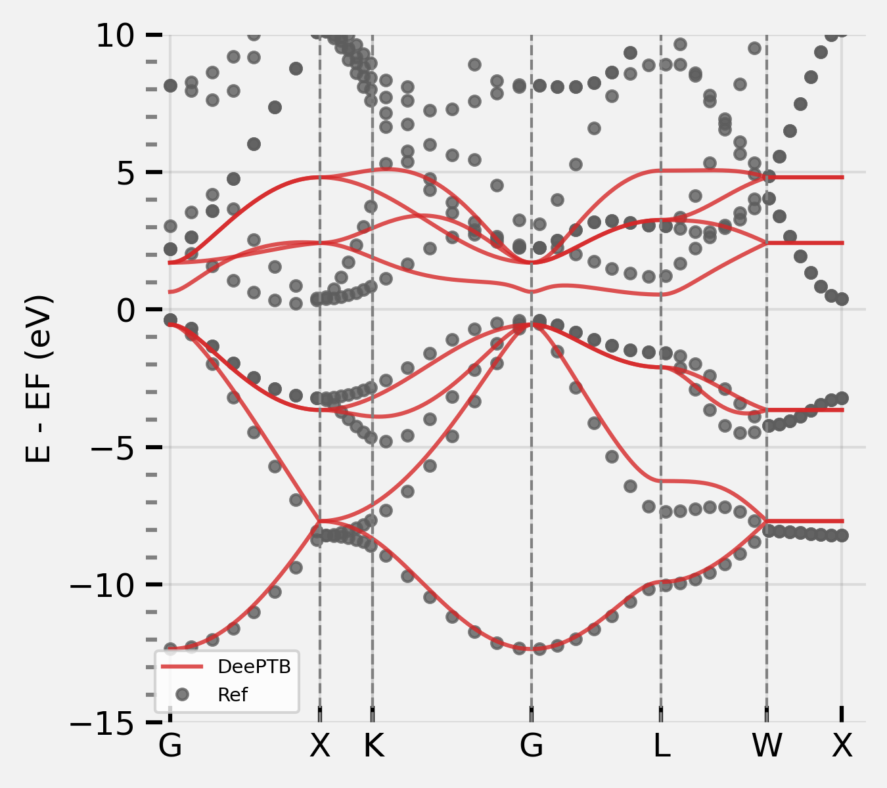
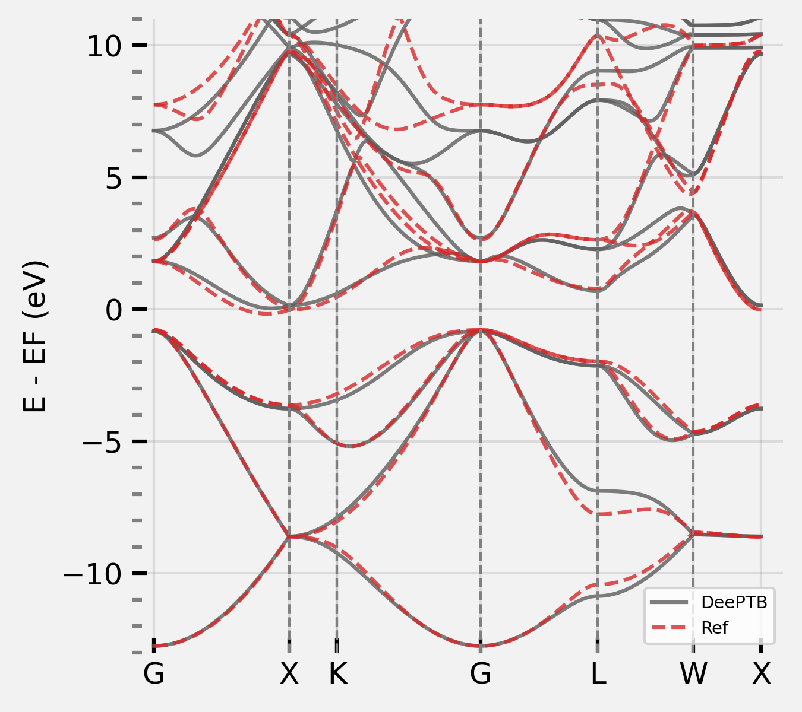
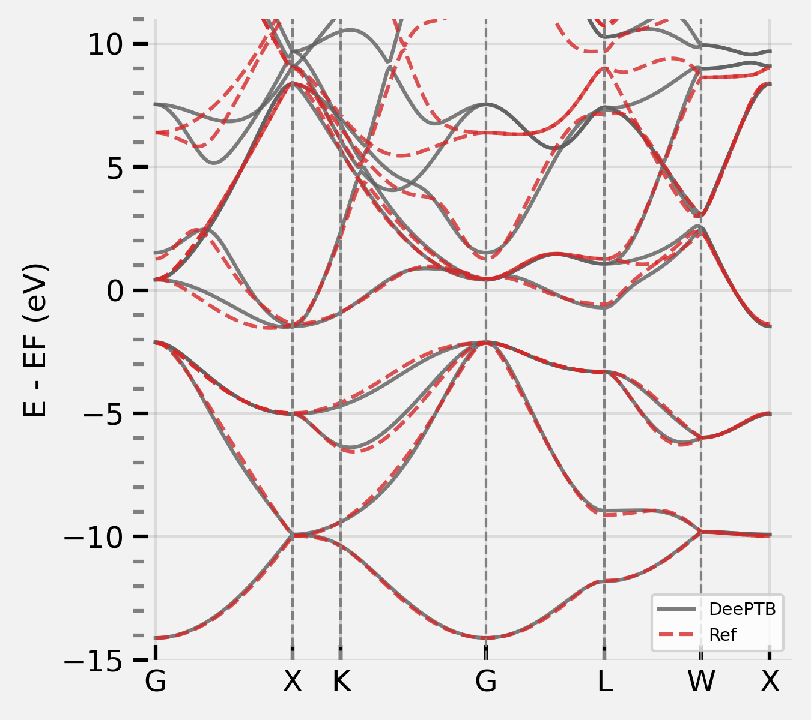
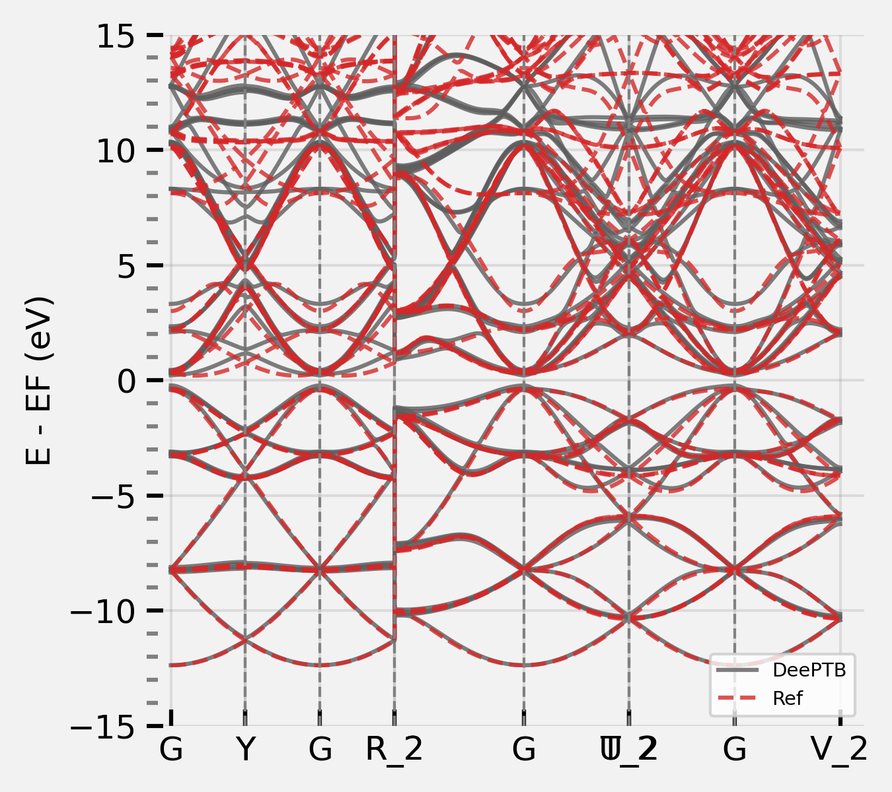
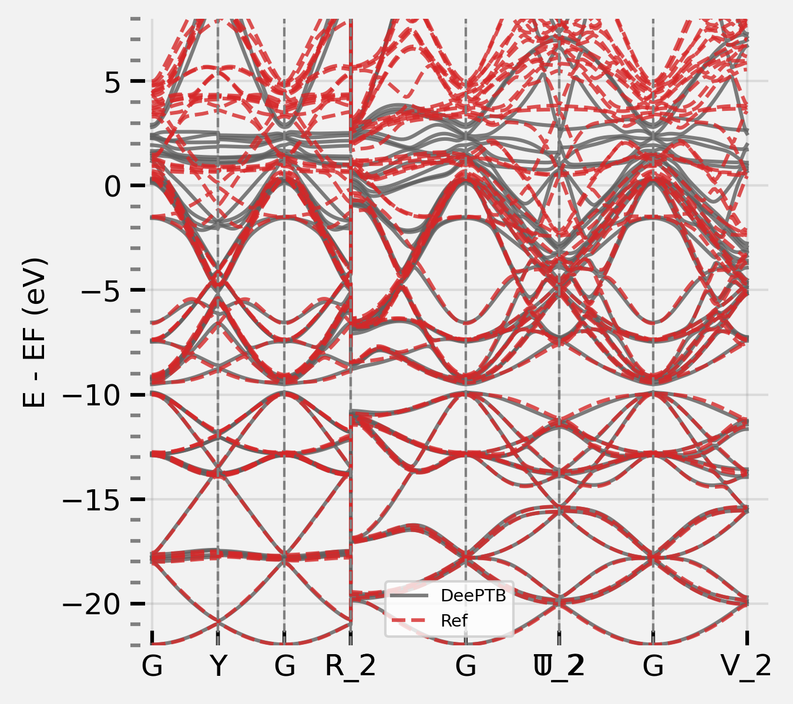

# **Example: Bulk Silicon.**
Bulk silicon has dimond structure at room tempreture and pressure. Due to its widespread applications in semi-conductor industry, it has been an significant important element in modern society. Here we provide an example to build a silicon **DeePTB** model. By following this instruction step-by-step, you will be introduced the high level functionalities of **DeePTB**, which can provide a model bypass emperical TB, to achieve *ab initio* accuracy.

The whole training procedure can be summarized as below:

These procedure contains the full steps to training an environmental corrected **DeePTB** model. The converged model can predict the electronic structure of both perfect crystals and the configurations with atomic distortion, while can generalize to structures with more atoms. For convinence, we provide all the training checkpoints in `ckpt`:
```bash
deeptb/examples/silicon/ckpt/
-- md/
-- -- 2-3-25K_best_nnsk_b5.000_c5.000_w0.100.pth # nnsk model trained on 25K MD trajectory
-- -- 2-3-100K_best_nnsk_b5.000_c5.000_w0.100.pth # nnsk model trained on 100K MD trajectory
-- -- 2-3-300K_best_dptb_b5.000_c5.000_w0.100.pth # nnsk model trained on 300K MD trajectory
-- -- 2-3-300K_best_nnsk_b5.000_c5.000_w0.100.pth # dptb model trained on 300K MD trajectory
-- 2-1_best_nnsk_b2.600_c2.600_w0.300.pth
-- 2-2-1_best_nnsk_b2.600_c2.600_w0.300.pth
-- 2-2-2_best_nnsk_b5.000_c5.000_w0.100.pth
```


## **1. Data Preparation**

The data for training and plotting contrains in `data` folders:
```bash
deeptb/examples/silicon/data/
-- kpath.0/ # bandstructure of primary cell
-- kpathmd25.0/ # bandstructure of 10 MD snapshots at T=25K
-- kpathmd100.0/ # bandstructure of 10 MD snapshots at T=100K
-- kpathmd300.0/ # bandstructure of 10 MD snapshots at T=300K
-- kpt.0/ # kmesh samples of primary cell
-- silicon.vasp
```
Each of these folders, contains data files with required format, here we give an examples of `kpath.0`:
```bash
deeptb/examples/silicon/data/kpath.0/
-- bandinfo.json
-- eigs.npy
-- kpoints.npy
-- xdat.traj
```

## **2. Training Neural Network Emperical Tight-Binding Model (nnsk)**

### **2.1 Training a First Nearest Neighbour Model**
We first analysis the bond-length by running.
```bash
dptb bond ./data/silicon.vasp
```
The output will be like:
```bash
 Bond Type         1         2         3         4         5
------------------------------------------------------------------------
     Si-Si      2.35      3.84      4.50      5.43      5.92
```

The fitting of emperical TB on the first nearest neighbours shares the same procedure as the `hBN` example. We suggest the user to try on hBN before proceeding. This time, the training starts from the first nearest neighbour checkpoint in `ckpt` folders.

### **2.2 Add More Orbitals and Neighbours**
Let's plot the converged `nnsk` model in last step, using `band.json` in `run/`, by:

```bash
dptb run -sk run/band.json -i ./ckpt/2-1_best_nnsk_b2.600_c2.600_w0.300.pth -o ./band
```

we can see, the fitted model has already captured the shape of the valance bands. However, the conductance band is less accurate since the orbitals `3s` and `3p` is not complete for the space spaned by the considered valance and conductance band. Therefore we need to include more orbitals in the model. 

<div align=center>

</div>

In **DeePTB**, users are able to add or remove orbitals by altering the input configuration file. Here we add `d*` orbital, which can permit us to fit the conductance band that are essential when calculating exitation properties such in photo-electronics and electronic transport.

First we add `d*` in `proj_atom_anglr_m` of input configuration, which looks like:
```json
"proj_atom_anglr_m": {
     "Si": [
          "3s",
          "3p",
          "d*"
     ]
}
```

Also, we need to change the learning-rate to `1e-3` to maintain the stability in the first few iterations. Then, we start training the model with `-i/--init-model` of our last checkpoint, by running:
```bash
dptb train -sk ./ckpt/2-2-1_input.json -i ./ckpt/2-1_best_nnsk_b2.600_c2.600_w0.300.pth -o nnsk
```

In this way, the parameters in `nnsk` model corresponding to `3s` and `3p` orbitals can be reloaded. 
When convergence is achieved, we can plot the band structure, which shows that both the valance and conductance band are fitted well:

<div align=center>

</div>

*Note: In practice, we find that training with the minimal basis set in begin, then increasing the orbitals gradually is a better choice than directly training with full orbitals from scratch. This procedure can help to reduce the basis size and to improve the training stability.*

To further enhance the model, we can enlarge the cutoff range considered, to build a model beyond the first nearest neighbours. The parameters that controls the cutoff radius: 
- `bond_cutoff` (angstrom unit): it indicate bonds that has bond-length smaller than which is included.

We first increase the `bond_cutoff` to larger than the bong-length of the third nearest neighbour, while shorter than the fourth. However, abruptly change of the cutoff will introduce discontinuity in the model training, we therefore introduce a smoothing function:
$$f_s(r)=\frac{1}{1+e^{(r-r_{skc})/\omega}}$$
 that controled by parameters:

- `sk_cutoff` (angstrom unit): $r_{skc}$ it controls the cutoff of the decay weight of each bond.
- `sk_decay_w`: $\omega$, it decides the smoothness of the decay.

<div align=center>

</div>

As is shown in the above figure, this smoothing function will decay centered at $r_{skc}$. According to the smoothness $\omega$, this function have different smoothness. Here, to adding more neighbours terms in to consideration while retaining the stability of fitting, we first set the $r_{skc}$ at the first-nearest neighbour distance, this decay function can supress the newly included second and third neighbour terms, which brings no abrupt changes to the predicted hamiltonians.

Then what is left is pushing $r_{skc}$ gradually to the value of `bond_cutoff`. This can be achieved by modify the parameters in input configuration, and repeat along with training with initalization manually. Alternatively, **DeePTB** support to push the smooth boundary automatically. We can set the `sk_cutoff` as a list of two value: [boundary1, boundary2]. **DeePTB** will push the sk_cutoff use linear interpolation during training. It is recommended to analysis the bond distribution before pushing. The boundary pushing often takes more training epochs. One can try to push the boundaries with configuration `ckpt/2-2-2-1_input.json` for pushing $r_{skc}$ and `2-2-2-2_input.json` for tightening $\omega$, or use the model after boundary pushing (since this step takes a few more iterations) in `ckpt/2-2-2_best_nnsk_b5.000_c5.000_w0.300.pth` for the next step:

<div align=center>

</div>

### **2.3 Training the Bond-length Dependent Parameters**
The emperical SK integrals in **DeePTB** is parameterized by various bond-length depdendent functions. This provide the representative power of `nnsk` model to modeling the change of electronic structure by atomic distortions. If the user want to learn the bond-length dependent parameters, or would like to add environmental correction to improve the accuracy, or to fit various of structures, this step is highly recommended.

The training of Bond-length Dependence parameters will use the dataset of MD snapshots. By modify the `data_options/train/prefix` in input configuration to `kpathmd25K/kpathmd100K/kpathmd300K` and training the model with initialized checkpoints. The parameters is easily attained. The checkpoint in `ckpt/md` provide the converged checkpoint of `nnsk` models on MD snapshots with different tempreture. The user can plot the bandstructure using `band_md.json`, with command:

```
dptb run -sk band_md.json -i ./ckpt/md/xxx.pth -o band
```

and checkout the `band/result` folder for the plottings. Here we illustrate the bandstructure plotting on a snapshot of 25K MD trajectory:

<div align=center>

</div>

We highly suggest to train model from low tempreture, and the transfer to higher tempreture to improve the fitting stability.

## **3. Training Deep Learning Tight-Binding Models with Environmental Correction (dptb)**
**DeePTB** provide powerful environmental dependent modeling with symmetry preserving neural networks. Based on the last step, we can further enhance the power of TB model to overcome the accuracy limit, bring by the two-center approximation. We denote the model that builds the environmental dependence as `dptb`.  With the converged checkpoint in last step, we can just run:
```bash
dptb train <input config> -crt <nnsk checkpoint path> [[-i|-r] <dptb checkpoint path>] [[-o] <output directory>] [-f]
```
To start training, e.p. if starting from the checkpoint `./ckpt/md/2-3-25K_best_nnsk_b5.000_c5.000_w0.100.pth`, we need to run:
```bash
dptb train ./ckpt/md/input.json -crt ./ckpt/md/2-3-25K_best_nnsk_b5.000_c5.000_w0.100.pth -o dptb300K -f
```

`-f` above indicate `--freeze` the `nnsk` model when training the `dptb` model. It is important to use `-f` when one initialize a new `dptb` model (i.e. without `-i/--init-model` or `-r/--restart`).

The only parameter need to be considered here is the `env_cutoff`. It indicate the chemical environment radius that centered at each atom. To ensure the spatical symmetries of the atom environment and the bond environment embeddings, the `env_cutoff` should be larger than 0.5*`bond_cutoff`.

During the training procedure, the `dptb` model will be saved periodicly as checkpoint. If one haven't freeze the `nnsk` model with `-f`, the trained `nnsk` model will also be saved. Then, we can use the converged model to predict the bandstructure, calculating properties supported by **DeePTB**, or get the predicted hamiltonian directly. We plot the bandstructure of the converged model on $T=300K$'s MD trajectory for illustration:
One can run:
```bash
dptb run band_md.json -i ./ckpt/md/2-3-300K_best_dptb_b5.000_c5.000_w0.100.pth -crt ./ckpt/md/2-3-300K_best_nnsk_b5.000_c5.000_w0.100.pth -o band
```
<div align=center>

</div>

Now you know how to train a **DeePTB** model, congratulations !